# Introduction

This LaTeX note was made during MSc thesis "Low Energy Transfer Orbits to Mars using Evolution Strategies" at DTU, Summer 20

It's primarily aimed at a somewhat experienced LaTeX user that wants a refresher, and current status on what, in my opinion, are the most essential LaTeX packages, which are old/deprecated and a quick overview / description for them all.

This is a LaTeX note that is targeted towards  academic writing, in particular, the workflow of writing in markdown (GitHub flavored) and converting to tex/pdf via `pandoc` with filters `pandoc-citeproc` and `pandoc-crossref`. Some of the package choices will reflect that. If  a LaTeX package decision is influenced by the use of `pandoc`, this is clearly stated.

This note can almost certainly be shortened and simplified, but time was limited.

# Packages and Preamble

## Preamble

If just using `LaTeX` without `pandoc`, simply remove all `%P` from the preamble below:

```latex
% NOTE: All vars already in default pandoc latex template or otherwise (see above), will be commented with notation %P.

%P \documentclass{12pt, a4paper}[article]

%%%%%%%%%% PREAMBLE %%%%%%%%%%
%%% Language, Encoding and Font %%%
%P \usepackage[english]{babel}  % For ensuring US hyphenation rules (in case system language UK).
%P \usepackage[utf8]{inputenc}  % Encode with UTF8 instead of ASCII.
%P \usepackage[T1]{fontenc}     % Encode output font in PDF using T1.

%%% Layout and Typography %%%
%P \usepackage{geometry}    % Paper size, margins, head, footer, orientation etc.
%P \usepackage{microtype}   % Load after font. Microtypography makes text look more pleasing.
%P \usepackage{float}       % Enables H position, which is stronger than h!.
\usepackage{xcolor}         % More colors, easily user defined colors, color boxes.
%P \usepackage{ulem}        % Allows strikeout text via \sout{}, and various underlining.
\usepackage{parskip}        % Set paragraph indent zero and vertical space increased.
\usepackage{csquotes}       % Recommended with biblatex so quotations are typeset right.

%%% Linking and referencing %%%
%P \usepackage[
%P pdfusetitle]                   % --- Put \author and \title into PDF metadata.
%P {hyperref}                   % All cross-referenced elements hyperlinks.
%P \usepackage{cleveref}        % auto-formatting cross-refs to chapter, section, equation, etc.
%P \usepackage{biblatex}        % Bibliographic citation. Defaults: backend=biber, style=numeric.
%P \addbibresource{sample.bib}  % Load in .bib file.

%%% Graphics %%%
%P \usepackage{graphicx}    % Enables \includegraphics command for figures.
%P \usepackage{grffile}     % Support a larger range of file names.
%P \usepackage{subfig}      % Enables subfigures via \subfloat command within figure env.
%P \graphicspath{{.fig/}}   % the . is necessary to set path relative to main tex file.

%%% Mathematics %%%
%P \usepackage{amsmath}     % Various math environments for typesetting and aligning math.
%P \usepackage{amssymb}     % Adds a lot of math symbols.
\usepackage{bm}             % For bold greek letters, e.g. \bm{\sigma}.
\usepackage{xfrac}          % For nice small sized fractions, typically text mode, \sfrac{}.

%%% Science %%%
\usepackage[
allowlitunits]            % --- units directly in mathmode e.g. 20\milli\meter without \SI.
{siunitx}               % Consistent numbers and units, ranges, decimals etc.
\usepackage{mhchem}     % Typesetting chemical molecular formulae and equations

\numberwithin{equation}{section}  % Number equations by section, e.g. 1.1, 1.2 etc. (from amsmath)

%%% Algorithms and Code %%%
\usepackage{algorithm2e}    % For algorithms in pseudocode.
\usepackage{lstlistings}    % For code syntax highlighting.
\usepackage{minted}         % For code syntax highlighting (fancier but pandoc+pdflatex).

\setminted{linenos=true}    % Display line numbers in minted.

% Misc
\usepackage{pdfpages}       % Insert external PDF documents, e.g. \includepdf[pages={1}]{document.pdf}

%%% NON-PACKAGES
%P \addbibresource{sample.bib}    % Load in .bib file.
```

### Honorable mentions

```latex
\usepackage{xspace}           % Can add space after user macro or not depending on context.
\usepackage{setspace}         % Line spacing.
\usepackage{datatool}         % Read data from csv files and build tables to display.
\usepackage{wrapfig}          % Wrap text around a figure.
\usepackage{longtable}        % For tables longer than a page.
\usepackage{multicol}         % Easily switch to multiple columns mid-document.
\usepackage{isodate}          % Many date formats, e.g ensure \today is is ISO (YYYY-MM-DD)
\usepackage{amsthm}           % Makes available the commands \proof,\qedsymbol and \theoremstyle.
\RequirePackage[l2tabu, orthodox]{nag}  % Checks for obsolete LaTeX packages and outdated commands.
\usepackage{fancyhdr}         % Full control over Control header, footer, page numbers etc.
\usepackage{empheq}           % EMPHasizing EQuations. Boxes around (multi-line) equations.
\usepackage{enumitem}         % Customized enumerated lists.
\usepackage{csquote}          % For more customizable quotes, useful for foreign languages.
\usepackage{fancyvrb}         % More fancy verbatim environement, including in footnotes.
\usepackage{setspace}         % Set line spacing.
```

The easy way to control paragraph indentation is with the `parskip` package. If you want to control it manually, use:

```latex
% The parskip package is often used instead of manually adjusting parindent and parskip
\setlength{\parindent}{0pt}   % Indent in the beginning of paragrahs (article default: 15pt)
\setlength{\parskip}{1em}     % Space between paragraphs (article default: 0.0pt plus 1.0pt, i.e. a stretch space, see <https://en.wikibooks.org/wiki/LaTeX/Lengths#Length_manipulation>
```

### Import Order

`hypperref` needs to be loaded before some, [after other packages](https://tex.stackexchange.com/questions/1863/which-packages-should-be-loaded-after-hyperref-instead-of-before).

`nag` must be loaded before `\documentclass` command using `RequirePackage`.

Note that from the `AMS-LaTeX Bundle`, only three packages have to be loaded explicitly: `amsmath`, `amssym` and `amsthm`. All else is loaded automatically from those three.[^ams-dependency]

## Package decisions

### Close calls

`bibtex+natbib` vs. `biber+biblatex` vs. `pandoc+.csl`

### Draws

#### Code syntax highlighting: `lstlisting` and `minted` vs. `pandoc`

Source code syntax highlighting is the only package where I choose to import two packages that does exactly the same things.

* `lstlistings` gives slight worse / more simple syntax highlighting, but works directly with pandoc via `--listings` option.
* `minted` gives the best / more thorough syntax highlighting, but requires `--shell-escape` and also doesn't work with pandoc directly, but need a two-step `pandoc+pdflatex` workflow (see [issue](https://github.com/jgm/pandoc/issues/4721)).

**I use standard `pandoc` when:**

1. I don't need line numbers so much
2. Don't need customization options or code line numbers.
3. It's an added benefit that it is HTML compatible.

**I use `lstlistings` when:**

1. When I need line numbers
2. It's important that it's LaTeX native, and I need to work with the .tex output.
3. ``--shell-escape` is not an option or preferred not used.

**I use`minted` when**

1. When I need line numbers.
2. The doc goes to latex as intermediate anyway.
3. I need an extra nice polished PDF product.
4. A language or customization that is not otherwise supported.

##### Detailed `lstlistings` vs. `minted`

* **Comparison links**
  * <https://tex.stackexchange.com/questions/389191/minted-vs-listings-pros-and-cons>
  * <https://tex.stackexchange.com/questions/102596/minted-vs-texments-vs-verbments>
* **Pros of `listings`**
  * `listings` the simple, native latex solution and doesn't depend on external libraries.
  * `listings` doesn't require `--shell-escape` in LaTeX (i.e. access to run external programs), making it easier to install, more portable and more secure in principle. However, in recent versions of `minted` the highlighted code can now be cached into an `.aux` file, making the document compatible on machines that does not / cannot give access to `--shell-escape` - however any changes to minted source code would have to be recompiled.
  * `pandoc` comes with a `--listings` option that converts to LaTeX using the `listings` package. However `minted` has to use a pandoc filter.
* **Cons of `listings`:**
  * doesn't do colored highlighting out of the box, only boldface on certain syntax. Color on a few types of keywords can be set manually. `minted` on the other have many build-in themes and sensible defaults.
  * doesn't use a lexer as `minted` does, so it's syntax highlighting is simpler
  * Supports fewer languages than minted

### Choices due to `pandoc` or `MathJax`

* `mathtools` is an extension of `amsmath`, but I use `amsmath` anyway because mathtools is not officially supported by MathJax, for live previews in Typora.
* `subcaption` seems newer and possibly better than `subfig` because `subfig` may have some compatibility issues with `hyperref`, but `pandoc-crossref` have adopted `subfig` for subfigures. If this turns out to be a problem, the developer of `pandoc-crossref` is [open for push requests](https://github.com/lierdakil/pandoc-crossref/issues/182).

### Made irrelevant by pandoc

Aside from the default template and various packages loaded as needed (see #P lines in preamble), there is also:

* `\graphicspath{{.fig/}}` can just be skipped when working in pandoc (not supported by pandoc yet, see [here](https://github.com/jgm/pandoc/issues/736))
* `biblatex` is loaded when using pandoc option `--biblatex` and is only optional when working with bibliography in Pandoc (see [bibliography guide](#bibliography)).

# Package descriptions

## Language, Encoding and Font

### babel

Basically for ensuring e.g. US English hyphenation rules, in case system language is set to UK English (or vice versa). Also allows mixing of languages.

The package manages culturally-determined typographical (and other) rules, and hyphenation patterns for a wide range of languages. A document may select a single language to be supported, or it may select several, in which case the document may switch from one language to another in a variety of ways.

Babel works together with `biblatex` and `microtype`.

NOTE: There is no real benefit of using babel when writing only in US-English, but it's good practice to do anyway:

> You should load **babel** if you're unsure about the default language. A system administrator in the UK may well have changed it to British English instead of US English (they have different hyphenation rules).[^babel-SO]

Users of `XeTeX` may alternatively use [polyglossia](https://ctan.org/pkg/polyglossia) instead of Babel.

#### Mixing languages

Suppose you have a document some parts of which are written in one language, and some parts in another, or others. For example, in an English document you might have extensive quotations in Greek, or whole sections written in German. Changing from one language to another might involve:

* different script(s) or special characters.
* different hyphenation patterns.
* different names for things like `date`, `section`, `figure` (names which LaTeX generates for you automatically).

It would be a pain to have to all this "by hand". The solution is to use the `Babel' package.

For an easy guide to using multiple languages, see source[^babel]

* <https://ctan.org/pkg/babel?lang=en>
* <http://mirrors.ctan.org/macros/latex/required/babel/base/babel.pdf>
* <http://mirrors.dotsrc.org/ctan/macros/latex/required/babel/base/babel.pdf>

### inputenc

<u>NB: only needed with `pdftex`, not with `xetex` or `luatex`</u>

`inputenc` tells TeX the encoding of your `.tex` file. Usually used to encode file with UTF8 instead of ASCII.

Do not use with `XeLaTeX` and `LuaTeX`.

<https://ctan.org/pkg/inputenc?lang=en>
<http://mirrors.dotsrc.org/ctan/macros/latex/base/inputenc.pdf>

#### With/without `inputenc`

```latex
\documentclass{article}

% \usepackage[T1]{fontenc}
\usepackage[utf8]{inputenc}

\begin{document}

© David Carlisle and cost £2000.
\end{document}
```

With `\usepackage[utf8]{inputenc}`:


Without `\usepackage[utf8]{inputenc}`:


### fontenc

`fontenc` tells TeX which encoding you want in the *output* file. Mostly it affects things like hyphenation. It depends on the fonts you select, since the name.[^fontenc] Note that this is *font* encoding (determines what kind of font is used), not *input* encoding.

Even if you write in English, if you don't use `\usepackage[T1]{fontenc}`, then[^fontenc2]:

* Words containing accented characters [cannot be automatically hyphenated](https://tex.stackexchange.com/questions/725/why-words-with-accented-characters-cant-be-automatic-hyphenated-with-the-default),
* You cannot properly copy-and-paste such words from the output (DVI/PS/PDF),
* Characters like the pipe sign, less than and greater sign [give unexpected results in text](http://texblog.net/latex-archive/fonts/symbols/).
* TeX is only able to apply ligatures and kernings between characters when these characters are real glyphs from the same font. In OT1 (with 128 glyphs) you only have more or less ASCII characters and all diacritics etc. are missing.
* Searching in the output is not working whenever a diacritic character is being used as that ends up being a complicated box structure in the output and not a character.

The default font encoding (OT1) of TeX is 7-bit and uses fonts that have 128 glyphs, and so do not include the accented characters as individual glyphs. So a letter ö is made by adding an accent to the existing 'o' glyph.

The [T1 font encoding](https://en.wikipedia.org/wiki/Cork_encoding) is an 8-bit encoding and uses fonts that have 256 glyphs. So an 'ö' is an actual single glyph in the font. Many of the older fonts have had T1 variants devised for them as well, and many newer fonts are available only in T1. I think "Computer Modern" was originally OT1, and "Latin Modern" is T1. (Look at [OT1 font encoding](http://www.micropress-inc.com/fonts/encoding/ot1.htm) and [T1 font encoding](http://www.micropress-inc.com/fonts/encoding/t1.htm).)[^fontenc2]

Do not use with `XeLaTeX` and `LuaTeX` (use `fontspec` instead).

<https://ctan.org/pkg/fontenc?lang=en>

## Cross-referencing and Citation

### hyperref

Has two major purposes:

1. All links, both internal and external, become hyperlinks in the PDF.
2. PDF metadata.

If option `pdfusetitle` is set then `hyperref` tries to derive the values for `pdftitle` and `pdfauthor` metadata from  `\title` and `\author`, as such:

`\usepackage[pdfusetitle]{hyperref}`

If you want to specified PDF metadata in detail manually, use e.g.:

```latex
\usepackage[pdftex,
            pdfauthor={Your Name},
            pdftitle={The Title},
            pdfsubject={The Subject},
            pdfkeywords={Some Keywords},
            pdfproducer={Latex with hyperref, or other system},
            pdfcreator={pdflatex, or other tool}]{hyperref}
```

It extends the functionality of all the LaTeX cross-referencing commands (including the table of contents, bibliographies etc.) to produce \special commands which a driver can turn into hypertext links; it also provides new commands to allow the user to write ad hoc hypertext links, including those to external documents and URLs.

* <https://ctan.org/pkg/hyperref?lang=en>
* <http://mirrors.dotsrc.org/ctan/macros/latex/contrib/hyperref/doc/manual.pdf>
* <https://www.sharelatex.com/learn/Hyperlinks>

#### Basic usage of `hyperref`

`\url{URL}`

### cleveref

The cleveref package enhances LATEX’s cross-referencing features by automatically formatting cross-references depending on what they refer to (chapter, section, equation, theorem, etc.). It can automatically format cross-references to multiple labels, and can sort lists of multiple cross-references, compresses consecutive labels into a reference range, and all kinds of other clever wizardry. It also does similar things with page references.  

> Another fascinating LaTeX package is [`cleveref`](https://archive.is/o/m2nLL/ctan.org/pkg/cleveref). This package introduces the `\cref` command. When using this command to make cross-references, instead of `\ref` or `\eqref`, a word is placed in front of the reference according to the type of reference: fig. for figures, eq. for equations. Hence, another LaTeX package that simplifies the writing.[^9essential]

Has to be loaded *after* `hyperref` (to be safe, load it *last*):

* <https://ctan.org/pkg/cleveref?lang=en>
* <http://mirrors.dotsrc.org/ctan/macros/latex/contrib/cleveref/cleveref.pdf>

#### Basic usage of `cleveref`

`\cref`, `\Cref`, `\crefrange`, `\cpageref`, `\cpagerefrange`.

* Wherever you would previously have used `\ref`, use `\cref` instead. (Except at the beginning of a sentence, where you should use \Cref.)
* **Automatic word prepending:** You no longer need to put the name of the thing you’re referencing in front of the `\cref` command, because cleveref will sort that out for you: i.e. use `\cref{eq1}` instead of `eq.~(\ref{eq1})`.
* **Range of labels:** use the `\crefrange` command: `\crefrange{eq1}{eq5}` produces eqs.~(1) to~(5).
* **Refer to multiple things at once:** you can simply throw them all into one cross-reference and leave cleveref to sort it out: e.g. `\cref{eq2,eq1,eq3,eq5,thm2,def1}` produces `eqs.~(1) to~(3) and~(5), theorem~5, and definition~1`.
* **Page reference:** use `\cpageref` (and don’t write “page” in front), if you want a page range, use `\cpagerefrange`, and if you want to refer to multiple pages, simply throw them all into a single `\cpageref`. Just as with \cref (above), cleveref will sort it all out for you automatically.

### biblatex

For generating and styling the bibliography / references section, and citations. See guide on [bibliography](#bibliography) for more details.

## Layout and Typography

### geometry

I consider this optional since the default latex margins etc. are usually pretty good.

The page dimensions in a LATEX document are highly configurable and the **geometry** package offers a simple way to change the length and layout of different elements such as the paper size, margins, footnote, header, orientation, etc.[^geometry]

Also allows changing page layout mid-document.

* <https://ctan.org/pkg/geometry?lang=en>
* <http://mirrors.dotsrc.org/ctan/macros/latex/contrib/geometry/geometry.pdf>
* <https://www.sharelatex.com/learn/Page_size_and_margins>

#### Basic usage of `geometry`

Besides centering problem, setting margins from each edge of the paper is also troublesome. But geometry also make it easy. If you want to set each margin to 1.5in, you can type

```latex
\usepackage[margin=1.5in]{geometry} % margin of 2cm on all sides
```

Thus, the geometry package has an auto-completion mechanism, in which unspecified dimensions are automatically determined.

The geometry package will be also useful when you have to set page layout obeying the following strict instructions. For example:

> The total allowable width of the text area is 6.5 inches wide by 8.75 inches high. The top margin on each page should be 1.2 inches from the top edge of the page. The left margin should be 0.9 inch from the left edge. The footer with page number should be at the bottom of the text area.

In this case, using geometry you can type:

```latex
\usepackage[total={6.5in,8.75in}, top=1.2in, left=0.9in, includefoot]{geometry}
```

Examples taken from the manual. [^geometry-manual]

### microtype

The microtype package improves the spacing between words and letters. It does a lot more and most people won’t notice the difference. But still, the resulting document will be easier to read and looks better when microtype is loaded. Load this package after fonts, if any, as the package behavior is dependent on this font.[^9essential]

`microtype` plays with ever-so-slightly shrinking and stretching of the fonts and with the extent to which text protrudes into the margins in a way that yields results that look better, that have fewer instances of hyphenation, and fewer overfull hboxes. It doesn't work with `latex`, you have to use `pdflatex` instead. It also works with `lualatex` and (protrusion only) with `xelatex[^microtype2]`.

There is a very good description of what microtype does [here](http://www.khirevich.com/latex/microtype/), that also goes through the options and customization.

* <https://ctan.org/pkg/microtype?lang=en>
* <http://mirrors.dotsrc.org/ctan/macros/latex/contrib/microtype/microtype.pdf>

### float

Enables H position, which places the float at precisely the location in the LaTeX code.

* <https://ctan.org/pkg/float?lang=en>
* <http://mirrors.dotsrc.org/ctan/macros/latex/contrib/float/float.pdf>

#### Basic usage of `float`

```latex
\begin{figure}[H]
...
\end{figure}
```

### colorx

More colors, easily user defined colors, color boxes.

Extends `color`. Things you cannot do it `color` but in `xcolor`[^color-vs-xcolor]:

1. **Use many named color definitions:** such as `orange`
2. **Easy user-definitions of new colors:** `\colorlet{<new color name>}{<old color name>}` (e.g. for `\colorlet{important}{red}`.
3. **The use of color mixtures:** E.g. using `\color{blue!30!green}`.

#### pandoc filter

There is a pandoc filter, [pandoc-latex-color](https://github.com/chdemko/pandoc-latex-color), that allows a nicer syntax in markdown that can convert into both LaTeX and PDF. However it needs to be fixed, it only works well for `md->pdf`, not `md->tex` (see [issue](https://github.com/chdemko/pandoc-latex-color/issues/1)). There are some strange issues with using `xcolor` and converting latex->pdf, see [here](https://groups.google.com/forum/?utm_medium=email&utm_source=footer#!msg/pandoc-discuss/m5zNI4h9xoo/w1xjWLCqCAAJ).

I suggest using color in math mode instead (see section [colorful equations](#colorful-equations)) for text, until the issues above are resolved, and use todo packages for colored comments/reviews.

#### Basic usage of `colorx`

For single paragraphs, use `\textcolor{color}{text}`:

```latex
This is normal text. And this should be a \textcolor{blue}{paragraph with color}.
```

For multiple paragraphs, use `\leavevmode{\color{[COLOR] ... }`:

```latex
Not colored text.

\leavevmode{\color{red}
Bla bla bla first paragraph here. And here is Poisson's equation:

$\{f,g\} = \sum\limits_{p,q}^{n} \left(\frac{\partial f}{\partial p} \frac{\partial g}{\partial q} - \frac{\partial f}{\partial q}\frac{\partial q}{\partial p} \right)$

where $q$ and $p$ are the generalized coordinates and impulses from Hamiltonian mechanics. This is the third paragraph
}

This is not colored text either.
```

This is currently not compatible with pandoc, see [Coloring text in LaTeX](#coloring-text-in-latex).


It's also possible get have colorful equations, see guide in [colorful equations](#colorful-equations).

* <https://ctan.org/pkg/xcolor?lang=en>
* <http://mirrors.dotsrc.org/ctan/macros/latex/contrib/xcolor/xcolor.pdf>
* <https://www.sharelatex.com/learn/Using_colours_in_LaTeX>
* <https://www.sharelatex.com/learn/Using_colours_in_LaTeX#Reference_guide> (for `dvipsnames` colors)

### ulem

The `ulem` package provides various types of underlining that can stretch between words and be broken across lines.

#### Basic usage of `ulem`

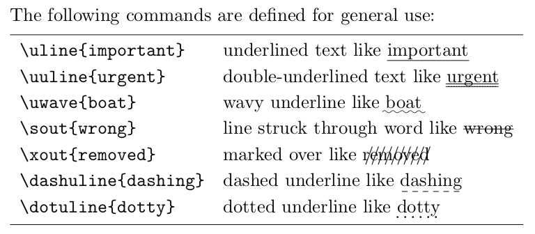

## parskip

By simply loading this package, then instead of adjusting manually, it alters the

1. `\parindent` to zero
2. `\parskip` increased slightly from default which often looks a little better.

If in doubt, and you just want a little more space between paragraphs, use this.

### Difference demo [^parskip]

```latex
\documentclass{article}
\usepackage[utf8]{inputenc}
\usepackage[english]{babel}

\usepackage{parskip}

\begin{document}
We explain in this section how to obtain headings
for the various sections and subsections of our
document.

In the ``article'' style, the document may be divided up
into sections, subsections and subsubsections, and each
can be given a title, printed in a boldface font,
simply by issuing the appropriate command.
\end{document}
```

Without `\usepackage{parskip}`:

### csquotes

Using biblatex with default settings without this gives a warning. When using babel or polyglossia with biblatex, loading csquotes is recommended to ensure that quoted texts are typeset according to the rules of your main language.[^csquotes]

`csquotes` is also good for quoting in foreign languages.[^csquotes2]

Supports commands such as `\MakeAutoQuote` that makes all ordinary quotes into `\enquote` (which is basically allows proper nested quotes).

Most commands on `csquote` is context sensitive. For example, `blockquote` will make quotation inline or display depending on length of text:

> This command determines the length of the text. If the length exceeds a certain threshold, the text will be typeset in display mode, i. e., as a block quotation. If not, `\blockquote` will behave like `\textquote`. [^csquotes-doc]

For example of use see also [How to quote correctly with csquotes?](https://tex.stackexchange.com/questions/103445/how-to-quote-correctly-with-csquotes) and [Sharelatex: Typesetting quotations](https://www.sharelatex.com/learn/Typesetting_quotations).

* <https://ctan.org/pkg/csquotes?lang=en>
* <http://mirrors.dotsrc.org/ctan/macros/latex/contrib/csquotes/csquotes.pdf>

## Graphics

### graphicx

This package introduces the `\includegraphics` command, which is needed for inserting figures.

The package builds upon the [graphics](https://ctan.org/pkg/graphics) package, providing a key-value interface for optional arguments to the `\includegraphics` command. This interface provides facilities that go far beyond what the [graphics](https://ctan.org/pkg/graphics) package offers on its own.

It's most basic purpose is the provide the `\includegraphics*[⟨key val list⟩]{⟨file⟩` command,  i.e. it's an improved version / LaTeX-style of `graphics`  that is TeX-style.

* <https://ctan.org/pkg/graphicx?lang=en>
* <http://mirrors.dotsrc.org/ctan/macros/latex/required/graphics/grfguide.pdf>
* <http://mirrors.ibiblio.org/CTAN/macros/latex/required/graphics/graphicx.pdf>

#### Deprecated alternatives

* `graphics`

### grffile

The package extends the file name processing of package graphics to support a larger range of file names. For example, the file name may contain several dots. Or in case of `pdfTEX` in PDF mode the file name may contain spaces.

* <https://ctan.org/pkg/grffile?lang=en>
* <http://mirrors.dotsrc.org/ctan/macros/latex/contrib/oberdiek/grffile.pdf>

### subfig

For making subfigures, e.g. two side-by-side figures, including `subcaptions`.

* <https://ctan.org/pkg/subfig?lang=en>
* <http://mirrors.dotsrc.org/ctan/macros/latex/contrib/subfig/subfig.pdf>

#### Basic usage of `subfig`

```latex
\begin{figure}
\centering
\subfloat[Subcaption for (a)]{\includegraphics[width=0.45\textwidth]{img1.jpeg}\label{fig:figureRefA}} \hfill
\subfloat[Subcaption for (b)]{\includegraphics[width=0.45\textwidth]{img2.jpeg}\label{fig:figureRefB}}
\caption{Caption of figure}
\label{fig:figureRef}
\end{figure}
```

The sub-caption is option and can be omitted:

```latex
\subfloat[]{\includegraphics[width=0.45\textwidth]{img1.jpeg}\label{fig:figureRefA}}
```

Then the sub-caption will simply say (a), (b), etc.

If you remove the square brackets all together as such:

```latex
\subfloat{\includegraphics[width=0.45\textwidth]{img1.jpeg}\label{fig:figureRefA}}
```

Then there will be no subcaption.

#### Alternatives

* [subcaption](https://ctan.org/pkg/subcaption?lang=en)
  * `subcaption` is a little newer, and doesn't have possible incompatibility issues as `hyperref` and `subfig` does. I use `subfig` anyway, mainly because `pandoc-crossref` [uses subfig](https://github.com/lierdakil/pandoc-crossref/issues/20#issuecomment-396065204), and the two are very close in functionality, so it was easiest to stick with. [Here](https://tex.stackexchange.com/questions/13625/subcaption-vs-subfig-best-package-for-referencing-a-subfigure) are pros/cons of subfig and subcaption. And [here](https://tex.stackexchange.com/questions/274259/recommended-package-for-making-same-height-subfigures) are suggestions for making same-height subfigures in both packages (though I'd prefer `\hfill` to `\quad`), see also [here](https://tex.stackexchange.com/a/361591/39354).
* Just plain tables (see [here](https://tex.stackexchange.com/a/330562/39354)). "It's best to avoid using additional packages for conference proceedings or journal submissions when you don't have to"[^subfigs-table]
* [subfigure](https://ctan.org/pkg/subfigure?lang=en) is deprecated. Since it doesn't use the `caption` package, it's not incompatible with some document classes as `subcaption` is, however in that case subfig and plain tables are still preferred.

#### Deprecated alternatives to `subfig`

* [subfigure](https://ctan.org/pkg/subfigure?lang=en)

## Mathematics

### amsmath

Three problems with the original `\eqnarray` from LaTeX that the environments from `amsmath` solves:[^avoid-eqnarray]

1. **Spacing inconsistency** - i.e. spacing between equations and equal sign is different between one line and multiline math.
2. **Overwriting of equation numbers** - that is, when lines gets to long, the equation number is just overwritten by the math, whereas `amsmath` environments pushes the equation number down.
3. **Silence of the labels** - no warning when duplicated labels are created, which can mess things up when cross-referencing it, even when `\nonumber` is applied.
4. **Less ampersands to type** - `x+y &=& z` versus `x+y &= z`.

It also provides more math environments. For more information and usage, see guide section [Mathematics](#mathematics).

* <https://ctan.org/pkg/amsmath?lang=en> (official documentation is quite impenetrable, refer to User's Guide instead)
* <http://texdoc.net/texmf-dist/doc/latex/amsmath/amsldoc.pdf> (User’s Guide for the `amsmath` Package)

#### Alternatives to `amsmath`

* [mathtools](https://ctan.org/pkg/mathtools?lang=en)
  * An extension of amsmath with more symbols and a few bug fixes, but not used since there is [no official support](https://github.com/mathjax/MathJax/issues/1582) in MathJax used in Typora (see also [sharelatex blogpost](https://www.sharelatex.com/blog/2012/06/12/mathtools-for-beautiful-math.html)).

### amssymb

Provides an extended symbol collection. Also loads `amsfont`; The AMSFonts collection is a set of miscellaneous TeX fonts that augment the standard Computer Modern set normally distributed with TeX. For a long list of mathematical symbols, see [amssymb-symbols.pdf](assets/amssymb-symbols.pdf)[^amssymb-symbols]

### xfrac

For nice, smaller sized fractions, typically in text mode via `\sfrac{}`.

* <https://ctan.org/pkg/xfrac?lang=en>
* <http://mirrors.dotsrc.org/ctan/macros/latex/contrib/l3packages/xfrac.pdf>

#### Basic usage of `xfrac`

```latex
\sfrac{1}{2},  $\sfrac{1}{2}$,
$\mathbf{3\times\sfrac{1}{2}}$
\quad \fontfamily{ppl}\selectfont Palatino: \sfrac{1}{2}
\quad \fontfamily{ptm}\selectfont Times: \sfrac{1}{2}
```

Result:

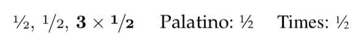

#### Warning

In the past, was `sfrac{}` was slow to compile with `microtype`.[^xfrac]

#### Alternatives to `xfrac`

* [nicefrac](https://ctan.org/pkg/nicefrac?lang=en)
  * Only works with default font Computer Modern and uses the virgule instead of the solidus.

## Science

### siunitx

Allows for consistent use of numbers and units, including formatting, decimals, ranges, hyphenation, etc.

> The [`siunitx`](https://archive.is/o/m2nLL/ctan.org/pkg/siunitx) package greatly simplifies TeXing when writing scientific documents, where units and numbers are a big part of the writing. This package adds commands like `\num` for typesetting numbers in all sorts of ways and `\si` for units. The commands I use a lot are `\SI` and `\SIrange`. For example,`\SI{10}{\hertz}` results in ‘*10Hz*‘ in text (this is especially useful to prevent typo’s; I tend to write HZ or hz a lot instead of Hz). The `\SIrange` command requires one more input variable: `\SIrange{10}{100}{\hertz}` produces ‘*10Hz to 100Hz*‘.[^9essential]

`\usepackage[allowlitunits]{siunitx}` is my normal incantation, it allows you to use things like `20\milli\meter` directly in math mode.[^allowlitunits]

The package provides the user macros:

* `\ang[⟨options⟩]{⟨angle⟩}`
* `\num[⟨options⟩]{⟨number⟩}`
* `\si[⟨options⟩]{⟨unit⟩}`
* `\SI[⟨options⟩]{⟨number⟩}[⟨pre-unit⟩]{⟨unit⟩}`
* `\numlist[⟨options⟩]{⟨numbers⟩}`
* `\numrange[⟨options⟩]{⟨numbers⟩}{⟨number2⟩}`
* `\SIlist[⟨options⟩]{⟨numbers⟩}{⟨unit⟩}`
* `\SIrange[⟨options⟩]{⟨number1⟩}{⟨number2⟩}{⟨unit⟩}`
* `\sisetup{⟨options⟩}`
* `\tablenum[⟨options⟩]{⟨number⟩}`

Also, `siunitx` provides a new column type, the S column. This is especially good for aligning numbers in different ways.

#### Useful options

```latex
\sisetup{
  range-phrase = --, % Unit ranges use "--" instead of "to"
  per-mode=symbol, % Default is reciprocal
  fraction-function=\tfrac % Default is frac, tfrac is slightly smaller
}
```

```latex
\si[per-mode = fraction]{\joule\per\mole\per\kelvin}
\si[per-mode = symbol]{\joule\per\mole\per\kelvin}
```

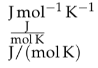

#### Basic usage of `siunitx`

* `\SI{40}{\meter\per\second}`
  * gives 40 m s^-1^
* `\num[scientific-notation = true, round-mode = figures, round-precision = 5]{5345.2528592868725}`
  * gives 5.34353 × 10^3^

### mhchem

Typesetting chemical molecular formulae and equations.

👍 Supported by MathJax/Typora

* <https://ctan.org/pkg/mhchem?lang=en>
* <http://mirrors.dotsrc.org/ctan/macros/latex/contrib/mhchem/mhchem.pdf> (lots of good examples)

## Algorithms and Code

### algorithm2e

Algorithm2e is an environment for writing algorithms. An algorithm becomes a floating object (like figure, table, etc.). The package provides macros that allow you to create different keywords, and a set of predefined key words is provided; you can change the typography of the keywords. The package allows vertical lines delimiting a block of instructions in an algorithm, and defines different sorts of algorithms such as Procedure or Function; the name of these functions may be reused in the text or in other algorithms.

* <https://ctan.org/pkg/algorithm2e?lang=en>
* <http://mirrors.dotsrc.org/ctan/macros/latex/contrib/algorithm2e/doc/algorithm2e.pdf>
* <https://www.sharelatex.com/learn/algorithms>

#### Alternatives to `algorithm2e`

There are many algorithm packages. Basically algorithm2e is the newest[^algorithm]:

* `algorithm` - float wrapper for algorithms.
* `algorithmic` - first algorithm typesetting environment.
* `algorithmicx` - second algorithm typesetting environment.
* `algpseudocode` - layout for `algorithmicx`.
* `algorithm2e` - third algorithm typesetting environment.

### lstlistings

Code syntax highlighting in a native LaTeX way.

The pack­age en­ables the user to type­set pro­grams (pro­gram­ming code) within LATEX; the source code is read di­rectly by TEX—no front-end pro­ces­sor is needed. Key­words, com­ments and strings can be type­set us­ing dif­fer­ent styles (de­fault is bold for key­words, italic for com­ments and no spe­cial style for strings). Sup­port for hy­per­ref is pro­vided.

Use in panda with option `--listings`.

* <https://ctan.org/pkg/listings?lang=en>
* <http://mirrors.dotsrc.org/ctan/macros/latex/contrib/listings/listings.pdf>
* <https://www.sharelatex.com/learn/Code_listing>

#### Basic usage of `lstlistings`

Example input:

```python
import itertools

def iter_primes():
     # an iterator of all numbers between 2 and +infinity
     numbers = itertools.count(2)

     # generate primes forever
     while True:
         # get the first number from the iterator (always a prime)
         prime = numbers.next()
         yield prime

         # this code iteratively builds up a chain of
         # filters...slightly tricky, but ponder it a bit
         numbers = itertools.ifilter(prime.__rmod__, numbers)

for p in iter_primes():
    if p > 1000:
        break
    print p
```

Command:

`pandoc --listings test.md -o test.pdf`

##### Default settings (lacks color, not so good)

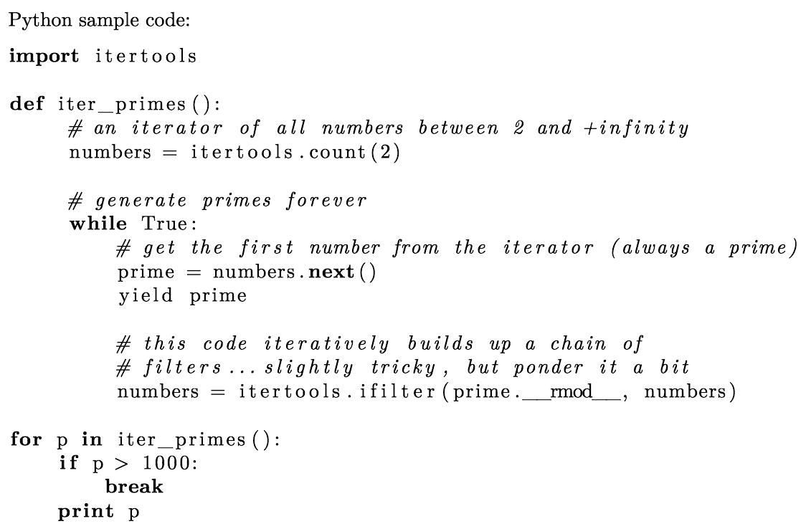

##### Added syntax highlighting - example theme 1[^overleaf-listings-theme]

````latex
header-includes:
 - |
  ```{=latex}
  \usepackage{xcolor}
  \definecolor{mygreen}{rgb}{0,0.6,0}
  \definecolor{mygray}{rgb}{0.5,0.5,0.5}
  \definecolor{mymauve}{rgb}{0.58,0,0.82}
  \lstset{ %
    backgroundcolor=\color{white},   % choose the background color
    basicstyle=\footnotesize,        % size of fonts used for the code
    breaklines=true,                 % automatic line breaking only at whitespace
    captionpos=b,                    % sets the caption-position to bottom
    commentstyle=\color{mygreen},    % comment style
    escapeinside={\%*}{*)},          % if you want to add LaTeX within your code
    keywordstyle=\color{blue},       % keyword style
    stringstyle=\color{mymauve},     % string literal style
  }
````

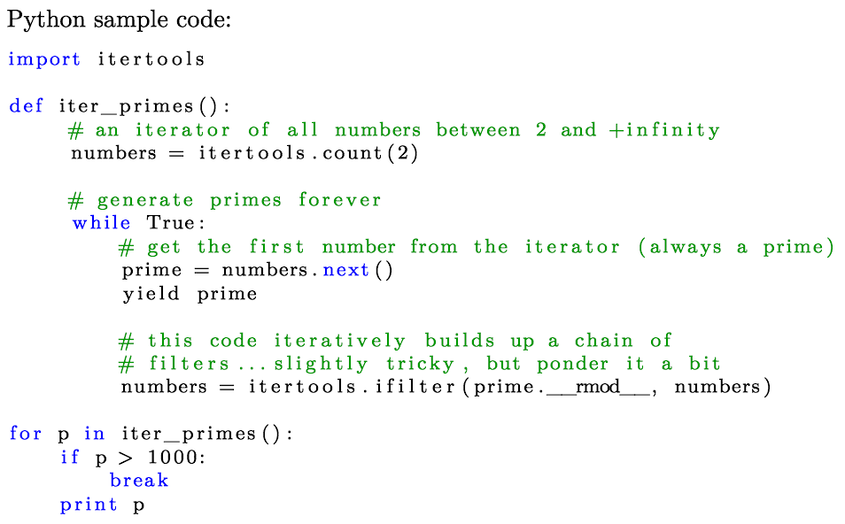

##### Added syntax highlighting - example theme 2

````latex
header-includes:
 - |
  ```{=latex}
  \usepackage{xcolor}
  \definecolor{codegreen}{rgb}{0,0.6,0}
  \definecolor{codegray}{rgb}{0.5,0.5,0.5}
  \definecolor{codepurple}{rgb}{0.58,0,0.82}
  \definecolor{backcolour}{rgb}{0.95,0.95,0.92}
  \lstdefinestyle{mystyle}{
    backgroundcolor=\color{backcolour},
    commentstyle=\color{codegreen},
    keywordstyle=\color{magenta},
    numberstyle=\tiny\color{codegray},
    stringstyle=\color{codepurple},
    basicstyle=\footnotesize,
    breakatwhitespace=false,
    breaklines=true,
    captionpos=b,
    keepspaces=true,
    numbers=left,
    numbersep=5pt,
    showspaces=false,
    showstringspaces=false,
    showtabs=false,
    tabsize=2
  }
  \lstset{style=mystyle}
````

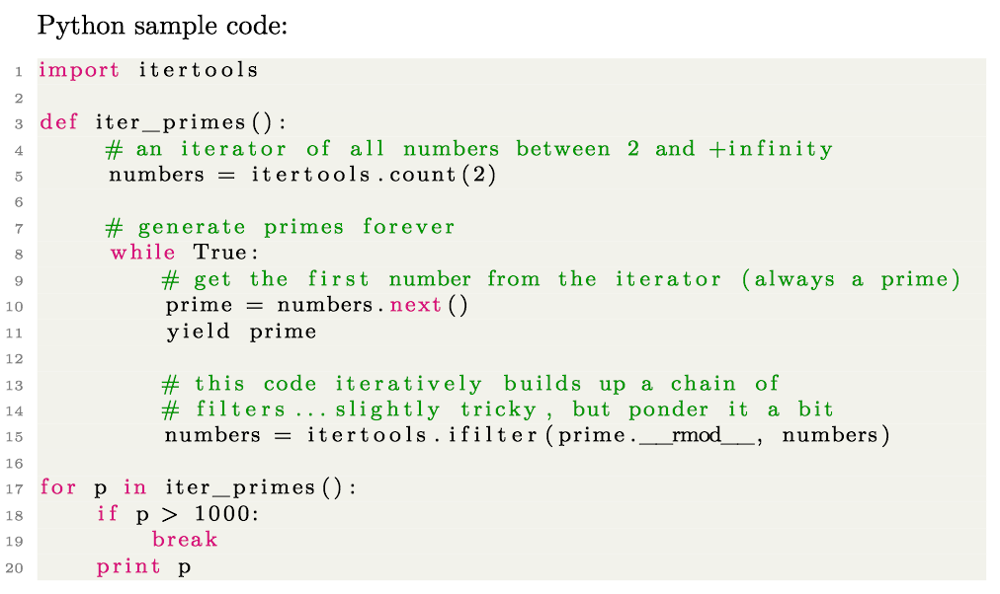

### minted

`minted` is a package that facilitates expressive syntax highlighting using the powerful Pygments library. The package also provides options to customize the highlighted source code output.

The two big advantages of `minted` over `listings` is:

1. Good default color themes
2. More detailed syntax coloring

However if you want your document more portable, and can accept simpler syntax highlighting, then `listing` is a fine option as well.

* <https://ctan.org/pkg/minted?lang=en>
* <http://ftp.acc.umu.se/mirror/CTAN/macros/latex/contrib/minted/minted.pdf>
* <https://www.sharelatex.com/learn/Code_Highlighting_with_minted>
* <https://www.overleaf.com/latex/examples/syntax-highlighting-in-latex-with-the-listings-package/jxnppmxxvsvk#.WzVnW6eB3OQ>
* <https://github.com/gpoore/minted>
* <https://blog.wizardsoftheweb.pro/syntax-highlighting-in-latex-with-minted/>
* <http://pygments.org/demo/>  (includes a lot more languages than the next link for some reason)
* <http://pygments.org/languages/>

#### Running `minted`

Must run with the `--shell-escape` option BEFORE the input .tex file. So e.g.:

`pdflatex --shell-escape test.tex`

#### Pandoc filter: `pandoc-minted`

Easiest way to install is:

`pip install pandoc-minted` ([pip page](https://pypi.org/project/pandoc-minted))

Put in header:

```yaml
font: system-ui
fontSize: 15
codeFont: "Roboto Mono"
codeFontSize: 13
lineHeight: 1.8
lineWidth: 100
tabSize: 2
useClassicTextCursor: false
useLargeFontInHeadings: true
```

Then run with:

 `pandoc -s --filter pandoc-minted test.md -o test.tex`

#### Basic usage of `minted`

```latex
---
header-includes:
- \usepackage{minted}
- \setminted{linenos=true}
---

​```python
import itertools

def iter_primes():
     # an iterator of all numbers between 2 and +infinity
     numbers = itertools.count(2)

     # generate primes forever
     while True:
         # get the first number from the iterator (always a prime)
         prime = numbers.next()
         yield prime

         # this code iteratively builds up a chain of
         # filters...slightly tricky, but ponder it a bit
         numbers = itertools.ifilter(prime.__rmod__, numbers)

for p in iter_primes():
    if p > 1000:
        break
    print p
```

Command: `pandoc -s -F pandoc-minted test.md -o test.tex && pdflatex --shell-escape test.tex`

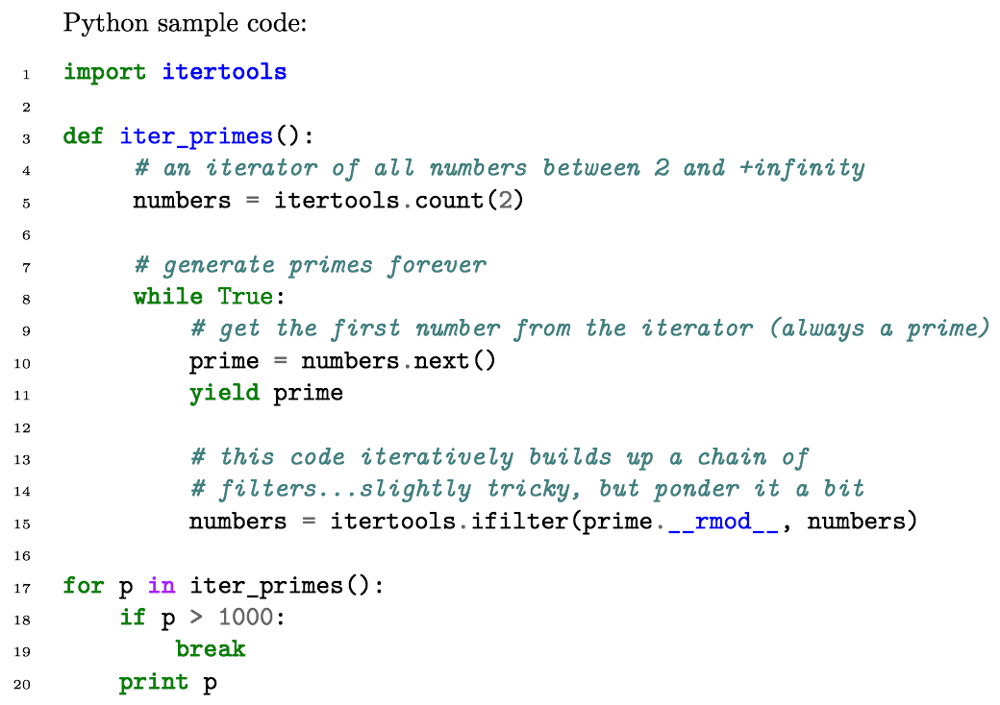

As can be seen, the syntax highlighting is more detailed than any other package.

### pandoc syntax highlighting

Unfortunately doesn't support line numbering, but otherwise similar to minted.

Same example as above, running with no options, pandoc will add the following to the preamble:

```latex
\DefineVerbatimEnvironment{Highlighting}{Verbatim}{commandchars=\\\{\}}
\newenvironment{Shaded}{}{}
\newcommand{\AlertTok}[1]{\textcolor[rgb]{1.00,0.00,0.00}{\textbf{#1}}}
\newcommand{\AnnotationTok}[1]{\textcolor[rgb]{0.38,0.63,0.69}{\textbf{\textit{#1}}}}
\newcommand{\AttributeTok}[1]{\textcolor[rgb]{0.49,0.56,0.16}{#1}}
\newcommand{\BaseNTok}[1]{\textcolor[rgb]{0.25,0.63,0.44}{#1}}
\newcommand{\BuiltInTok}[1]{#1}
\newcommand{\CharTok}[1]{\textcolor[rgb]{0.25,0.44,0.63}{#1}}
\newcommand{\CommentTok}[1]{\textcolor[rgb]{0.38,0.63,0.69}{\textit{#1}}}
\newcommand{\CommentVarTok}[1]{\textcolor[rgb]{0.38,0.63,0.69}{\textbf{\textit{#1}}}}
\newcommand{\ConstantTok}[1]{\textcolor[rgb]{0.53,0.00,0.00}{#1}}
\newcommand{\ControlFlowTok}[1]{\textcolor[rgb]{0.00,0.44,0.13}{\textbf{#1}}}
\newcommand{\DataTypeTok}[1]{\textcolor[rgb]{0.56,0.13,0.00}{#1}}
\newcommand{\DecValTok}[1]{\textcolor[rgb]{0.25,0.63,0.44}{#1}}
\newcommand{\DocumentationTok}[1]{\textcolor[rgb]{0.73,0.13,0.13}{\textit{#1}}}
\newcommand{\ErrorTok}[1]{\textcolor[rgb]{1.00,0.00,0.00}{\textbf{#1}}}
\newcommand{\ExtensionTok}[1]{#1}
\newcommand{\FloatTok}[1]{\textcolor[rgb]{0.25,0.63,0.44}{#1}}
\newcommand{\FunctionTok}[1]{\textcolor[rgb]{0.02,0.16,0.49}{#1}}
\newcommand{\ImportTok}[1]{#1}
\newcommand{\InformationTok}[1]{\textcolor[rgb]{0.38,0.63,0.69}{\textbf{\textit{#1}}}}
\newcommand{\KeywordTok}[1]{\textcolor[rgb]{0.00,0.44,0.13}{\textbf{#1}}}
\newcommand{\NormalTok}[1]{#1}
\newcommand{\OperatorTok}[1]{\textcolor[rgb]{0.40,0.40,0.40}{#1}}
\newcommand{\OtherTok}[1]{\textcolor[rgb]{0.00,0.44,0.13}{#1}}
\newcommand{\PreprocessorTok}[1]{\textcolor[rgb]{0.74,0.48,0.00}{#1}}
\newcommand{\RegionMarkerTok}[1]{#1}
\newcommand{\SpecialCharTok}[1]{\textcolor[rgb]{0.25,0.44,0.63}{#1}}
\newcommand{\SpecialStringTok}[1]{\textcolor[rgb]{0.73,0.40,0.53}{#1}}
\newcommand{\StringTok}[1]{\textcolor[rgb]{0.25,0.44,0.63}{#1}}
\newcommand{\VariableTok}[1]{\textcolor[rgb]{0.10,0.09,0.49}{#1}}
\newcommand{\VerbatimStringTok}[1]{\textcolor[rgb]{0.25,0.44,0.63}{#1}}
\newcommand{\WarningTok}[1]{\textcolor[rgb]{0.38,0.63,0.69}{\textbf{\textit{#1}}}}
```

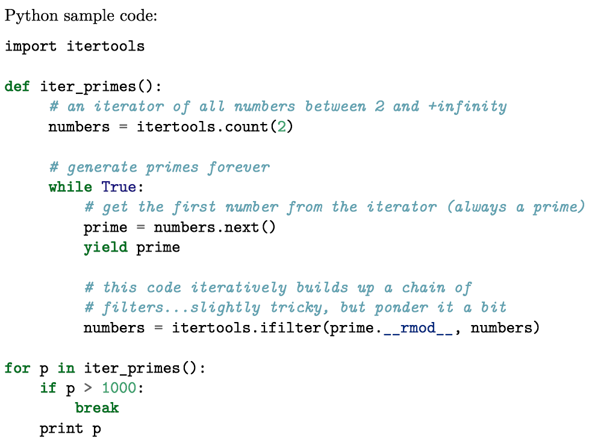

It's worth noting that options can be put into pandoc code blocks, (see section [fenced_code_attributes](https://pandoc.org/MANUAL.html#fenced-code-attributes)). E.g. to how line numbers and start counting at 100, use:

```latex
​``` {.python .numberLines startFrom="100"}
...
​```
```

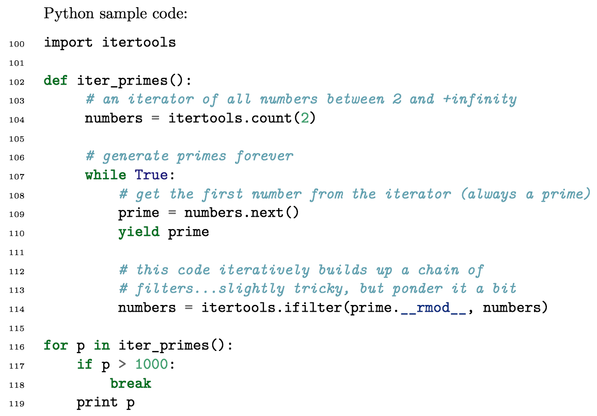

## Miscellaneous

### pdfpages

This package simplifies the inclusion of external multi-page PDF documents in LaTeX documents.

* <https://ctan.org/pkg/pdfpages?lang=en>
* <http://mirrors.dotsrc.org/ctan/macros/latex/contrib/pdfpages/pdfpages.pdf>

#### Basic usage of `includepdf`

`\includepdf{filename}`

`\includepdf[pages={1}]{document.pdf}`

## Extra

The following packages are not included in the default preamble.

### xspace

Useful when using user-defined text macros. Will add space after the macro or not depending on context.

Example from documentation:

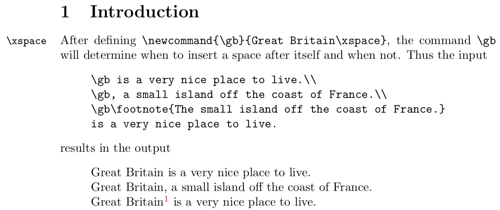

* <https://ctan.org/pkg/xspace>
* <http://mirrors.dotsrc.org/ctan/macros/latex/required/tools/xspace.pdf>

### setspace

Line spacing.

LaTeX line spacing can be set at various abstraction levels and can be difficult to set consistently for all elements of the document.

<https://ctan.org/pkg/setspace?lang=en>

#### Basic usage of `setspace`

Global options:

```latex
\singlespacing
\onehalfspacing
\doublespacing
```

Custom spacing:

```latex
\setstretch{<factor>}
```

### datatool

Read data from csv files and build tables to display.

<https://ctan.org/pkg/datatool?lang=en>

### wrapfig

LaTeX places floats so that they occupy the entire horizontal space around them, with no text alongside them. This improves readability and is usually preferred.

If you really want to flow text around a figure, this can be done with `wrapfig`.

<https://ctan.org/pkg/wrapfig?lang=en>

### longtable

For tables longer than a page.

<https://ctan.org/pkg/longtable?lang=en>

### multicol

Easily switch to multiple columns mid-document.

#### Basic usage of `multicol`

```latex
\begin{multicols}{3}
[
\section{First Section}
All human things are subject to decay. And when fate summons, Monarchs must obey.
]
Hello, here is some text without a meaning.  This text should show what a printed text will look like at this place. If you read this text, you will get no information.  Really?  Is there no information?  Is there...
\end{multicols}
```

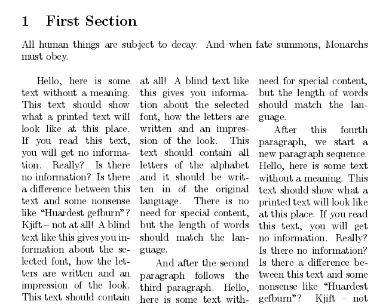

* <https://ctan.org/pkg/multicol?lang=en>
* <https://www.sharelatex.com/learn/Multiple_columns>

### isodate

To make sure you have ISO formatted dates (YYYY-MM-DD).

This package provides ten output formats of the commands `\today`, `\printdate`, `\printdateTEX`, and `\daterange`(partly language dependent).

Formats available are: ISO (yyyy-mm-dd), numeric (e.g. dd.\,mm.~yyyy), short (e.g. dd.\,mm.\,yy), TEX(yyyy/mm/dd), original (e.g. dd. mmm yyyy), short original (e.g. dd. mmm yy), as well as numerical formats with Roman numerals for the month.

<https://ctan.org/pkg/isodate?lang=en>

### enumitem

Allowed for customized enumerated lists.

<https://ctan.org/pkg/enumitem?lang=en>

#### Basic usage of `enuitem`

Gives numbers in square brackets:

`\begin{enumerate}[label={[\arabic*]}]`

# Guides

## Document Structure

Classical LaTeX document structure.

Much of this is based on <https://en.wikibooks.org/wiki/LaTeX/Document_Structure#The_document_environment>

### title, author, date, abstract

```latex
\documentclass[a4paper]{article}

\begin{document}

\title{How to Structure a LaTeX Document}
\author{Andrew Roberts}
\date{December 2004}
\begin{abstract}
%...
\end{abstract}

\maketitle
\tableofcontents

\section{...}

\end{document}
```

### front matter, main matter, back matter, appendix

```latex
\begin{document}
\frontmatter

\maketitle

% Introductory chapters
\chapter{Preface}
% ...

\mainmatter
\chapter{First chapter}
% ...

\appendix
\chapter{First Appendix}

\backmatter
\chapter{Last note}
```

## Mathematics Guide

### Math Quick Guide

#### Math for pure LaTeX

Quick-Guide:

* **For inline math:** use `\(...\)`
* **For display math:**
  * BASIC
    * **Unnumbered, single-line:** Use `\[...\]`. For most readable results, put `\[` and `\]` on separate lines.
    * **Numbered, single-line:** Use `\begin{equation}`.
    * **Numbered, multiple lines, one label per line**: Use `\align`.
  * ADVANCED
    Within an a display math environment (e.g. `equation` or `align`):
    * **Numbered, one equation on multiple lines, one label centered, manually aligned:** Use`\begin{equation}\begin{split}` for one equation split over multiple lines, and label centered over all lines with manual alignment using `&` as for `align`.
    * **Numbered, several equations on multiple lines, one label per line, centered-aligned:** Use `\begin{gather}` for multiple independent equation on multiple lines, one label per line, all center-aligned.
    * **Numbered, one equation on multiple lines, one label in total, unaligned:** Use `\begin{multline}` for one equation split over multiple lines, and label at last line, with alignment: first left, centered, last right.

One could get away fine with just using `align` everywhere for display math. But `\equation` will give a little more compact spacing for single equations, and the "advanced" environments may look nicer sometimes. For the Typora workflow, `align` is currently not feasible, which is an argument for getting used to using `equation` and `equation+aligned` everywhere instead to conform with the pandoc output from writings in Typora.

#### Math for Typora

..and any other editor using the `.md->.tex` workflow via `pandoc`.

**Important limitations:**

* **Lack of align:** One cannot preview an `align` environment, only an `aligned` environment inside an `equation` environment. As a consequence, there is no nice way of getting a display math block in Typora that numbers all the lines, not just one of them.

  The following shows up correctly in live preview but can't be converted via pandoc since it contains nested math environments (but curiously it works from Typora File->Export->LaTeX, so Typora must strip the outer math environment in the process). GitHub Issue here and here.

  ```latex
  $$
  \begin{align}
  ...
  \end{align}
  $$$
  ```

As a consequence, it's impractical, if not impossible to number all / most equations as a rule of thumb as `align` would, i.e. follow "Fisher's Rule". For discussion on numbering of equations, see section [Which equations should be numbered?](#which-equations-should-be-numbered?)

Quick-Guide:

* **For inline math:** use `$...$`, will be converted to `\(...\)` by pandoc.

* **For display math:**

  * BASIC

    * **Unnumbered, single-line:** `$$...$$`. Put each `$$` on their own line, i.e. in Typora, press *enter* after two `$$` to enter equation editor, with resulting source code:

      ```markdown
      $$
      ...
      $$
      ```

    * **Numbered, single-line:** `$$...$$`, add the `pandoc-crossref` label *on a separate line*, after closing `$$` as such:

      ```markdown
      $$
      ...
      $$
      {#eq:somelabel}
      ```

      which will convert into:

      ```latex
      \begin{equation}
      ...
      \label{eq:somelabel}\end{equation}
      ```

      The label must be on a separate line, otherwise Typora's live preview breaks.

    * 👎 **Numbered, multiple lines, one label per line**: Currently not possible without breaking Typora's live preview (see [issue](https://github.com/typora/typora-issues/issues/63#issuecomment-399854849)). Use `\begin{aligned}` within displaymath environment (`aligned` works within displaymath whereas `align` is a displaymath environment itself).

  * ADVANCED
    Within an a display math environment (e.g. `equation` or `align`):

    * **Numbered, one equation on multiple lines, one label centered, manually aligned:** Use`\begin{split}` for one equation split over multiple lines, and label centered over all lines with manual alignment using `&` as for `align`.

    * **Numbered, several equations on multiple lines, one label per line, centered-aligned:** Use `\begin{gathered}` for multiple independent equation on multiple lines, one label per line, all center-aligned.

    * 👎 **Numbered, one equation on multiple lines, one label in total, unaligned:** Use `\begin{multlined}` for one equation split over multiple lines, and label at last line, with alignment: first left, centered, last right. However, it's not included in `amsmath` but in the extension `mathtools`, which is not in MathJax, and therefore not in Typora live previews. Luckily this is one of my lesser used math environments anyway.

### TeX vs. LaTeX Math Notation

Based on [^inline-math], [^display-math] and [^math-notation].

| Math Style | Notation  | Origins | Short form of         | `amsmath` redefines it to          | Comment                                                                                                                                                                               |
| ---------- | --------- | ------- | --------------------- | ---------------------------------- | ------------------------------------------------------------------------------------------------------------------------------------------------------------------------------------- |
| Inline     | `$...$`   | `TeX`   |                       |                                    | Still widely used. Use in Typora (for live preview). May be unsupported in LaTeX3. I sometimes use it in nested environments, see [piecewise functions](#piecewise-functions)         |
| Inline     | `\(...\)` | `LaTeX` |                       |                                    | Use in pure LaTeX                                                                                                                                                                     |
| Display    | `$$...$$` | `TeX`   |                       |                                    | No reason to use. Can give inconsistent spacing.[^tex-$$] May be unsupported in LaTeX3. Use either `\[...\]` or an `amsmath` environment.                                             |
| Display    | `\[...\]` | `LaTeX` | `\begin{displaymath}` | `\begin{equation*}` [^ams-display] | It's a good habit to put each of these pairs on a line by itself. Though TeX doesn't care, this makes displays stand out visually and makes editing and revising the tex file easier. |
|            |           |         |                       |                                    |                                                                                                                                                                                       |

#### Inline `$...####  vs. `\(...\)` discussion

See [this](https://tex.stackexchange.com/questions/510/are-and-preferable-to-dollar-signs-for-math-mode) discussion.
Principally  `\(...\)`  is the real LaTeX syntax one should use.
In practice they give identical results, but there are slightly more pros to the real `\(...\)` LaTeX syntax IMO.

Pro `$...$`:

* Many systems seems to favor the former TeX syntax `($...$)` for inline math, including Typora.
* Can be easier to read in source code.

Pro  `\(...\)`:

* Will probably be favored in LaTeX3 and `$...$` may [not be supported](https://tex.stackexchange.com/a/513/39354) .
* Easier to parse in scripts since it's non-symmetric (i.e. much easier to pattern match)
* May give less obscure error messages when there is a mistake inside it.
* Configuring `\(` and `\)` for inline math tags in [MathJax](http://www.mathjax.org/) is beneficial as you don't need to escape `$` in your HTML contents.

#### Inline math for pure LaTeX

* **Inline:** use `\(...\)`
  * Generally better error messages
  * `$...$` likely to be phased out in LaTeX3, so may as well get used to it.

#### Inline math for Typora

* **Inline:** use `$...$` – for live preview, pandoc convert into `\(...\)` anyway.

For `$...$` vs. `\(...\)` see [this](https://tex.stackexchange.com/questions/510/are-and-preferable-to-dollar-signs-for-math-mode) discussion. Principally the latter is the real `LaTeX` (``\(...\)``) syntax that one should use, but in practice they are identical, and many systems seems to favor the former `TeX` syntax (`$...$`) for inline math, including Typora.

### `amsmath` Environments

Inspired by[^sharelatex-amsmath] and [^env-difference].

#### Environments table overview

| Environment        | Description                                                                    |                                                                 |
| ------------------ | ------------------------------------------------------------------------------ | --------------------------------------------------------------- |
| **equation**       | A single equation, single line (a little more compact than `align` space-wise) |  |
| **equation-split** | Multiple lines, one centered label.                                            |  |
| **align**          | Multiple lines, multiple alignment points.                                     |  |
| **gather**         | Multiple lines of equations all centered with no alignment.                    |  |
| **multline**       | Long equations split over multiple lines, left then right alignment.           |  |
| **flalign**        | Two sets of equations, first left-aligned, second right-aligned.               |  |

#### equation

*Single equation, single line.*

```latex
\begin{equation}
e^{\pi i} + 1 = 0
\end{equation}
```


#### equation-split

*Multiple lines, one centered label.*

```latex
\begin{equation} \label{eq1}
\begin{split}
A & = \frac{\pi r^2}{2} \\
 & = \frac{1}{2} \pi r^2
\end{split}
\end{equation}
```


#### align

*Multiple lines, multiple alignment points.*

```latex
\begin{align}
x&=y           &  w &=z              &  a&=b+c\\
2x&=-y         &  3w&=\frac{1}{2}z   &  a&=b\\
-4 + 5x&=2+y   &  w+2&=-1+w          &  ab&=cb
\end{align}
```


#### gather

*Grouping and centering.*

Multiples lines of (typically different) equations all centered with no alignment.

```latex
\begin{gather}
2x - 5y =  8 \\
3x^2 + 9y =  3a + c
\end{gather}
```


#### multline

*Long equations split over multiple lines, left then right alignment.*

Split long equation across multiple lines. Similar to `equation-split`, but:

```latex
\begin{multline}
p(x) = 3x^6 + 14x^5y + 590x^4y^2 + 19x^3y^3\\
- x - 2x^2 + 4x^4y^2 - 12x^2y^4 - 12xy^5 + 2y^6 - a^3b^3
\end{multline}
```


```latex
\begin{multline}
p(x) = 3x^6 + 14x^5y + 590x^4y^2 + 19x^3y^3\\
- 12x^2y^4 - 12xy^5 + 2y^6 - a^3b^3\\
- 12x^2y^4 - 12xy^5 + 2y^6 - a^3b^3\\
- 12x^2y^4 - 12xy^5 + 2y^6 - a^3b^3 - a^3b^3\\
- 12x^2y^4 - 12xy^5 + 2y^6 - a^3b^3
\end{multline}
```


| Number of lines         | Alignment of lines                  |
| ----------------------- | ----------------------------------- |
| If two lines            | First line left, next line right.   |
| If three or more lines: | First left, then center, last right |

#### flalign

*Two sets of equations, first left-aligned, second right-aligned.*

```latex
\begin{flalign}
a & = b &
  x & = y \\
c & = d &
  z & = u + v
\end{flalign}
```


### `equation` vs `align`

One reason to use `\equation` over `\align` (both `amsmath` environments) is that it's more compact, i.e. uses less vertical and horizontal space[^equation-vs-align]:

```latex
\section{Example 1 - Vertical Space}
hello
\begin{equation}
a+b=c
\end{equation}

hello
\begin{align}
a+b&=c
\end{align}

\section{Example 2 - Horizontal Space}
Using ``equation'':
 \begin{equation}
  1+2+3+4+5+6+7+8+9+10
  = 11+12+13+14+15+16+17+18+19+20+21
 \end{equation}

 Using ``align'':
 \begin{align}
  1+2+3+4+5+6+7+8+9+10
  = 11+12+13+14+15+16+17+18+19+20+21
 \end{align}
```


This is because `equation` will use something like `\abovedisplayshortskip` instead of the normal `\abovedisplayskip`, thus eliminating some white space above the formula. Align cannot do this by construction.[^equation-vs-align2]

For discussion see [TeX.SE: What's the difference between split and aligned?](https://tex.stackexchange.com/questions/187938/whats-the-difference-between-split-and-aligned)

### `\[aligned\]` vs. `align`

 `\[aligned\]` is essentially meant to be a single equation, whereas `align` is meant for several equations. Consequently, the first is more compact as seen here (this applies to the other "-ed" environments that works inside of display math mode, e.g. `aligned`, `alignedat` `split`, `gathered`)[^align*-vs-aligned]:

```latex
\hrule
\[
\begin{aligned}
q       &=CV \\
        &=3e-20x1000  \\
        &=3e-17
\end{aligned}
\]
\hrule

\bigskip

\hrule
\begin{align*}
q       &=CV \\
        &=3e-20x1000  \\
        &=3e-17
\end{align*}
\hrule
```


### Math Tips

#### Which equations should be numbered?

There are basically three schools of thought on this[^number-equations]:

1. *Fisher's Rule*: Number every equation, every time.
2. *Occam's Rule*: Number only those equations which are referred back to.
3. *Fisher-Occam Rule*: Number those equations which *might* be referred back to.

##### Argument for Fisher's Rule

> [...]Fisher's rule is for the benefit not of the author, but the reader.
>
> For although you, dear author, may have no need to refer in your text to the equations you therefore left unnumbered, it is presumptuous to assume the same disposition in your readers. And though you may well have acquired the solipsistic habit of writing under the assumption that you will have no readers at all, you are wrong. There is always the referee. The referee may desire to make reference to equations that you did not. Beyond that, should fortune smile upon you and others actually have occasion to mention your analysis in papers of their own, they will not think the better of you for forcing them into such locutions as "the second equation after (3.21)" or "the third unnumbered equation from the top in the left-hand column on p.2485." Even should you solipsistically choose to publish in a journal both unreferred and unread, you might subsequently desire (just for the record) to publish an erratum, the graceful flow of which could only be ensured if you had adhered to Fisher's rule in your original manuscript.[^mermin]

##### Argument for Occam's Rule

>A LaTeX hacker can write code which will cause an equation number to be generated if and only if the equation is later referenced, which bypasses the Fisher-Occam Rule. I wish, therefore, to defend Occam’s Rule itself.
>
> Many equations are displayed only because their content is too long or high to fit conveniently into a paragraph (matrices, commutative diagrams, and sets in braces come to mind), not because they are of special interest. Others are intermediate steps in a calculation which cannot be avoided. Most of the remainder are displayed for local emphasis, but will not be referenced. None of these equations requires a label. Numbering each displayed equation leads to large equation numbers, most of which are never used. More importantly, an equation number signifies the author’s opinion that the display is particularly important, a distinction which is lost under Fisher’s Rule.
>Regarding inconvenience to the reader, editors and referees generally refer to specific lines of text when making suggestions or corrections in hard-copy manuscripts, and displayed equations need not be an exception. The future scholar who wishes to cite a displayed equation—numbered or unnumbered—does the reader a serious disservice by not rewriting the equation into the document. According to Mermin’s own good advice, the author should remind the reader verbally of the content of an equation already in the reader’s hands. It makes even more sense for the author not to burden the reader with a trip to the library to locate information from an outside reference.
>The suggestion from the “no numbers” end of the spectrum is to associate each important displayed equation with a numbered item (be it a lemma, theorem, definition, or remark) and to number equations locally (as in “equations (1)–(3) following Theorem 4.2”) when numbering cannot be avoided.[^hwang]

##### My own take

There seem to be no right or wrong answer. I naturally tend towards agreeing with Fisher's rule since I don't think it breaks the readability / looks of the text, and there are other ways to emphasize an equation than giving it a number (e.g. a box). However, I can also see the  other point of view, and the fact that Typora can only do live preview of `equation` environments, makes Fisher's rule impractical if not impossible when using Typora. For that reason, I'm currently gravitating towards the ambiguous "*Fisher-Occam Rule*".

##### Recommended reading on the subject

* <https://math.stackexchange.com/questions/2362196/when-should-an-equation-be-numbered-when-writing-a-paper>
* <http://www.geo.umass.edu/faculty/wclement/Writing/equations.pdf>
* <http://www.ams.org/notices/199508/hwang.pdf>

#### Spaces in math mode[^math-space]

```latex
\begin{align*}
f(x) =& x^2\! +3x\! +2 \\
f(x) =& x^2+3x+2 \\
f(x) =& x^2\, +3x\, +2 \\
f(x) =& x^2\: +3x\: +2 \\
f(x) =& x^2\; +3x\; +2 \\
f(x) =& x^2\ +3x\ +2 \\
f(x) =& x^2\quad +3x\quad +2 \\
f(x) =& x^2\qquad +3x\qquad +2
\end{align*}
```


#### Multiline subscripts on sums or integrals

```latex
\sum_{\substack{1\le i\le n\\ i\ne j}}
```


#### Piecewise functions

```latex
\[
|x|=
\begin{cases} x & \text{if $x\geq0$,}
\\
-x &\text{if $x\le 0$.}
\end{cases}
\]
```


#### Boxed equations

##### 👍`\boxed` (Works in Typora)

Can be done with `\boxed` from `mathsmath`:

```latex
\boxed{ i \hbar \frac{\partial}{\partial t}\vert\Psi(\mathbf{r},t)\rangle = \hat H\vert\Psi(\mathbf{r},t)\rangle }
```

$$
\boxed{ i \hbar \frac{\partial}{\partial t}\vert\Psi(\mathbf{r},t)\rangle = \hat H\vert\Psi(\mathbf{r},t)\rangle }
$$

##### 👎 `empheq` (does not work in Typora)

For multi-line boxed equations, use `empheq`  that depends on `mathtools` and is not in MathJax:

```latex
\begin{empheq}[innerbox=\fbox,
               left=L\Rightarrow]{align}
a&=b\\
  E&=mc^2 + \int_a^a x\, dx
\end{empheq}
```


Or make box wider by defining a `widefbox`:

`\newcommand*\widefbox[1]{\fbox{\hspace{2em}#1\hspace{2em}}}`

#### Colorful equations

👍 Works in Typora

You can best colorful equations such as this:[^colorful-equations]
$$
\definecolor{energy}{RGB}{114,0,172}
\definecolor{freq}{RGB}{45,177,93}
\definecolor{spin}{RGB}{251,0,29}
\definecolor{signal}{RGB}{18,110,213}
\definecolor{circle}{RGB}{217,86,16}
\definecolor{average}{RGB}{203,23,206}
\color{energy} X_{\color{freq} k} \color{black} =
\color{average} \frac{1}{N} \sum_{n=0}^{N-1}
\color{signal}x_n \color{spin}
e^{\mathrm{i} \color{circle} 2\pi \color{freq}k \color{average} \frac{n}{N}}
$$
$$
\begin{aligned}
& \text{To find }
{\color{energy}{\text{the energy }}}
{\color{freq}{\text{at a particular frequency}}}
\text{, }
{\color{spin}{\text{spin }}}
{\color{signal}{\text{your signal }}}
{\color{circle}{\text{around a circle }}} \\
& {\color{freq}{\text{at that frequency}}}
\text{, and }
{\color{average}{\text{average a bunch of points along that path}}}
\text{.}
\end{aligned}
$$

[Issue](https://github.com/mathjax/MathJax/issues/2013) pending on whether colored text is possible.
$$
{\color{COLOR}{\text{TEXT}}}
$$

##### MathJax Colors

By default, HTML and RGB colors is available in MathJax[^mathjax-colors].
Other colors can be enabled by importing e.g. `\usepackage[usenames, dvipsnames]{color}`, see [here](https://www.sharelatex.com/learn/Using_colours_in_LaTeX#Reference_guide).

### LaTeX Math Guides

* <http://texdoc.net/texmf-dist/doc/latex/amsmath/amsldoc.pdf> (User’s Guide for the `amsmath` Package (Version 2.1) )
* <https://faculty.math.illinois.edu/~hildebr/tex/displays.html> (Generally many good tips for math typesetting in LaTeX)

## Tables

There are *a lot* of tables packages for LaTeX.

Overview: <https://tex.stackexchange.com/questions/12672/which-tabular-packages-do-which-tasks-and-which-packages-conflict>

**My approach:**  
For basic usage, I tend to use the simple table functionality in Typora or use the online generator ttps://www.tablesgenerator.com/ (hint: enable "Booktabs table style" in dropdown menu)
I tend to gravitate towards booktabs since it's vertical-lines-lessness is a good look, and there are some good guides online.

**Recommended reading:**

* <https://www.inf.ethz.ch/personal/markusp/teaching/guides/guide-tables.pdf>  
* <https://msu.edu/~amunn/latex/nano-companion.pdf> (Chapter 5 Dealing with tables)

**See examples for inspiration:**

* <https://en.wikibooks.org/wiki/LaTeX/Tables>

**Reference:**

* <https://ctan.org/pkg/booktabs?lang=en>
* <http://mirrors.dotsrc.org/ctan/macros/latex/contrib/booktabs/booktabs.pdf>

## TikZ

I have personally not found TikZ worth the steep learning curve and gravitate towards Mathematica and vector drawing tools such as Sketch on Mac for my needs (I previously used Inkscape). I'm impressed with many of the examples I see, but I haven't wanted to prioritize it so far.

If I ever decide to learn some TikZ, these links seem very promising:

* <https://cremeronline.com/LaTeX/minimaltikz.pdf> (smaller guide, feasible to skim / light read it all)
* <http://mirrors.dotsrc.org/ctan/graphics/pgf/base/doc/pgfmanual.pdf> (big ass guide, mostly for quick skim and reference.

Great examples:

* <http://www.texample.net/tikz/examples/feature/foreach/>

## Modular Documents

Good modular document guides:

1. <https://en.wikibooks.org/wiki/LaTeX/Modular_Documents> (really good overview of all options)
2. <https://www.sharelatex.com/learn/Management_in_a_large_project> (guide to managing large project by file division, i.e. `input`/`include` commands and `import`  package)
3. <https://www.sharelatex.com/learn/Management_in_a_large_project> (guide to managing large projects by independent multi-files, i.e. `subfiles` and `standalone`).

### Quick-quick guide

**My preference:** Use `input` for small documents, `include` for larger documents (both are built-in commands).

I like to keep it simple, without nested imports and multiple relative paths, and usually just have one central preamble.

* Use `import` package if you want :
  * Nested imports
  * Relative paths to imported docs
* Use `subfiles` package if you want:
  * Separate compilation of each child documents independently, using the same preamble

  ... and don't use Pandoc or Typora to be able to preview subfiles easily.

* Use `standalone` if you want:
  * Separate compilation of each child documents independently, using each their own preamble

### Quick guide

1. **Want one preamble & compilation of just master.tex, and simply import documents?**

   Use `\input{}` for simple input and `\include{}` for page breaks and only doing necessary recompilations.

   NOTE: Don't include `.tex` file extension (it's optional for `\input` but won't work with `\include`)

   NOTE: If using a text editor that can build LaTeX, use `%!TEX root = ../master.tex`  in first line of subfiles, which will make editor to always compile `master.tex` when pressing "build".

2. **Want one preamble & separate compilation of all child documents?**

   Use  `\import{}{}` and `\subimport{}{}`, from package `import`, which supports relative paths from child docs are needed. Can also be nested.

3. **Want independent preambles and separate compilation of all child documents too, using child's own preamble?**

   Use `standalone` class: In `master.tex` use the usual `input`/`include` commands and in child documents start with `\documentclass{standalone}` followed by preamble and content.

### Detailed guide

#### Approach 1: Only run `master.tex`

##### Approach 1.1 Refer to subfiles with no nesting using built-in commands

 Split up the document into several files using `input` or `include`.

tl;dr: Use `\input{}` for smaller documents where you don't want to force page breaks, use `\include` for larger documents where each included file should start/end on it's own page.

1. `input` that is a low level, very basic input of content as if it was there. Can be used anywhere, also nested, be in preamble, in packages, inside document. Very simple, no side effects, no extra features. One level is recommended to reduce complexity of the document.
2. `include` is bigger and is supposed to be used with bigger amounts of content, like chapters, which people might like to compile on their own during the editing process.[^input-include] Can only be used in document, can't be nested. In preamble, one can use `\includeonly{filename1,filename2,...}` (no spaces), then only the files specified between the curly braces will be included.

For details see <https://tex.stackexchange.com/questions/246/when-should-i-use-input-vs-include>

##### Approach 1.2 Same but allow nesting and multiple relative paths

Use [import](http://ctan.org/pkg/import) package.

* to allow nesting: use commands `\import{}` and `\includefrom`.
* to allow multiple relative paths: use commands  `\subimport` and `\subincludefrom`.

##### Bonus: In an editor, run master.tex when pressing build on any child file

In a chapter, add as the very first line: `%!TEX root = ../master.tex`

NB: May have to use backslash `\` for windows.

This "magic ", originally used by TeXShop, now adopted by many editors. More info: <https://tex.stackexchange.com/a/287145/39354>

#### Approach 2: In addition, also allow separate compilation of `.tex` chapters

##### Approach 2.1:  Use the preamble in the main file

Use `subfiles` package.

Use `subfile{}` in main document, and enjoy being able to run the subfile stand-alone using the preamble in main doc. The `\subfile` command is more like `\input` than `\include` in the sense that it does not start a new page. It allows nesting, but there is no exclusion mechanism analogous to `\includeonly`.[^subfiles]

##### Approach 2.2:  Every subfile has it's own preamble, and all are joined in main file

Use [standalone](https://ctan.org/pkg/standalone) package.

In `master.tex` the usual  `input`/`include` commands and in child documents start with `\documentclass{standalone}` followed by preamble and content. It's designed for moving more of the opposite direction than subfiles. It provides a means for importing the preamble of child documents into the main document, allowing for a flexible way to include text or images in multiple documents (e.g. an article and a [presentation](https://en.wikibooks.org/wiki/LaTeX/Presentations)).[^modular]

## Bibliography

There are basically three choices:

1. `bibtex+natbib` (old / classic) - best compatibility with many journal requirements, but no Unicode. Uses `.bst` styles.
2. `biber+biblatex` (new / modern) - less compatible with many journal requirements, but allows Unicode. Uses it's own styles.
3. `pandoc+.csl` (universal .csl) - `pandoc` allows use of `.csl` style files that are universal bibliography styles.

Sharelatex writes:

> Biblatex is a modern program to process bibliography information, provides an easier and more flexible interface and a better language localization that the other two options.[^sharelatex-biblatex]
> Note: If you are starting from scratch it's recommended to use biblatex since that package provides localization in several languages, it's actively developed and makes bibliography management easier and more flexible.[^sharelatex-natbib]

My ranking +quick-quick guides:

1. Use `pandoc+.csl`, if everything an be done within pandoc (i.e. references will be "hard-coded" into `.tex` files and that's ok). Use pandoc style citation commands in markdown, e.g. `[@einstein05;feynman38]` (see [pandoc bibliography](#citing-in-pandoc) section for more examples), then optionally `--biblatex` for pandoc command, which will convert pandoc citations into `\autocite` and `\autocites` from the `biblatex` package.

2. Use `biber+biblatex` unless:
   1. Submitting to a journal that does not accept it.
   2. Have problems with slow compilation that is solved by using `bibtex+natbib` instead.

   Use `autocite` everywhere for citing, which will style citations according to chosen style, or can be set manually as `autocite=plain, inline, footnote, superscript, ...` option for `\usepackage{biblatex}`.

3. Use `bibtex+natbib` as last resort.
   Use `\citet` for textual citation and `\citep` for parenthetical citation.

### Bibliography style vs. citation style

**Citation style:** How citations appear in text.

**Bibliography style:** Formatting of references chapter + citation style.

### What is `bibtex`, `biber`, `natbib` and `biblatex`?

#### 1. Factual answer[^bib-factual]

##### Backend: External programs that process bibliography information

...and act (roughly) as the interface between your .bib file and your LaTeX document:

* **`bibtex` (old)**
* **`biber` (new)**
  * **\+** able to deal with many more entry and field types in the `.bib` file.
  * **\+** able to deal with UTF-8 encoded `.bib` files.
  * **\+** better sorting control.
  * **–** Only works with `biblatex`, not with `natbib`.
  * **–** Some claim that `biber` is slower than `bibtex`.
  * **–** It is not trivial to include the bibliographies created by `biblatex` into a document (as many publishers require.). `bibtex` compiles all the information from the .bib file and outputs it to the .bbl in the expected format, `biber` does not.

##### Frontend: LaTeX packages that format citations and bibliographies

* **`natbib` (old)**  - works only with `bibtex`
* **`biblatex`(new)** - works with both `bibtex` and `biber`
  * **\+** Humanities style citations.
  * **\+** Unicode enabled .bib files (when used with `biber)`.
  * **\+** All formatting of citations and bibliography entries is done using regular LaTeX macros. As a consequence, regular LaTeX users are able to make modifications to existing styles quite easily.
  * **–** Journals and publishers may not accept documents that use `biblatex` if they have a house style with its own `natbib` compatible .bst file.

#### 2. Visual answer[^bib-visual]

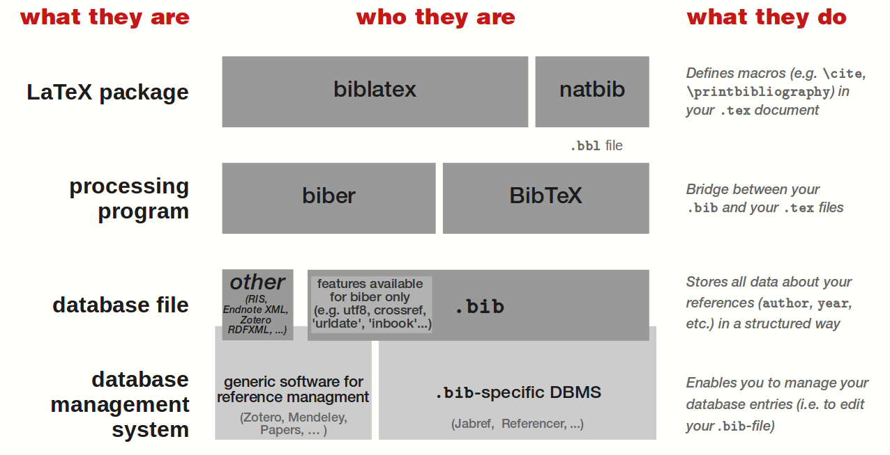

To use your database (i.e. your `.bib` file) within your LaTeX document, you need an external program to process it — that is, to transform your `.bib` file into a `.tex` understandable one.

Therefor, you can use either `biber` or `BibTeX`. They both use your `.bib` file as input, even if some of its features/fields might be available for `biber` only (e.g. `utf8` encoding, the fields `crossref`, `urldate`, ...).

To display your bibliography and use citing commands, you need to use a LaTeX package. You can use either `biblatex`, or `natbib`. *With the latter, your .bib file need to be processed with BibTeX.* But if you use `biblatex`, you can process your `.bib` file either with `biber`, or with `BibTeX`.

### Bibliography Styles

`.bst` is a BibTeX style file and LaTeX-only.

`.csl` is a universal standard. It's an XML-based language for citation and bibliography styles. It aims to be a universal language that can be used by all kinds of reference managers and word processors.[^csl-vs-biblatex] It does not currently seem to be supported within LaTeX, however through the use of `pandoc` it is possible to use a `.csl` for bibliography style (requires the whole workflow to be kept within `pandoc`).[^csl-in-latex]

`biblatex` has some built-in supported styles.

### Quick Guide:`natbib`

**Summary:**

```latex
\usepackage{natbib}
... % cite, citep, citet
\bibliographystyle{sample} % [OPTIONAL] loads in sample.bst or one of the standard styles
\bibliography{sample.bib}
```

Example with `natbib` (i.e. pure BibTeX), a model LaTeX document would look as follows:[^natbib-biblatex]

```latex
\documentclass{<someclass>}

\usepackage[<options>]{natbib}

\begin{document}

A bare citation command: \citep{<key>}.

A citation command for use in the flow of text: As \citet{<key>} said \dots

\bibliographystyle{<somestyle>}
\bibliography{<mybibfile>}% Selects .bib file AND prints bibliography

\end{document}
```

#### natbib commands

Common cite commands[^natbib-documentation]

* `\citep{jon90}` for a parenthetical citation (Jones et al., 1990),
* `\citet{jon90}` for a textual one, as Jones et al. (1990).

Both `\citep` and `\citet` are defined by natbib and are thus not standard. The standard LaTeX command `\cite` should be avoided, because it behaves like `\citet` for author–year citations, but like `\citep` for numerical ones. There also
exist the starred versions `\citet*` and `\citep*` that print the full author list, and not just the abbreviated one.

With optional arguments:

| `\citet{jon90}`               | Jones et al. (1990)                |
| ----------------------------- | ---------------------------------- |
| `\citet[chap. 2]{jon90}`      | Jones et al. (1990, chap. 2)       |
| `\citep{jon90}`               | (Jones et al., 1990)               |
| `\citep[chap. 2]{jon90}`      | (Jones et al., 1990, chap. 2)      |
| `\citep[see][]{jon90}`        | (see Jones et al., 1990)           |
| `\citep[see][chap. 2]{jon90}` | (see Jones et al., 1990, chap. 2)  |
| `\citet*{jon90}`              | Jones, Baker, and Williams (1990)  |
| `\citep*{jon90}`              | (Jones, Baker, and Williams, 1990) |

Multiple citations may be made by including more than one citation key in the \cite command argument. If adjacent citations have the same author designation but different years, then the author names are not reprinted:

| `\citet{jon90,jam91}`   | Jones et al. (1990); James et al. (1991) |
| ----------------------- | ---------------------------------------- |
| `\citep{jon90,jam91}`   | (Jones et al., 1990; James et al. 1991)  |
| `\citep{jon90,jon91}`   | (Jones et al., 1990, 1991)               |
| `\citep{jon90a,jon90b}` | (Jones et al., 1990a,b)                  |

*Capitalized versions:*

Note that all `natbib`cite commands come with a 'capitalised version' (i.e. first letter of command is capitalised), which capitalise the first word they print.

For more commands see:

* <http://merkel.texture.rocks/Latex/natbib.php>
* <http://mirrors.dotsrc.org/ctan/macros/latex/contrib/natbib/natbib.pdf>

BibTeX only links:

* <https://www.sharelatex.com/learn/Bibliography_management_with_bibtex>
* <https://www.sharelatex.com/learn/Bibtex_bibliography_styles>

natbib links:

* <https://www.sharelatex.com/learn/Bibliography_management_with_natbib>
* <https://www.sharelatex.com/learn/Natbib_bibliography_styles>
* <https://www.sharelatex.com/learn/Natbib_citation_styles>

CTAN:

* <https://ctan.org/pkg/natbib?lang=en>
* <http://mirrors.dotsrc.org/ctan/macros/latex/contrib/natbib/natbib.pdf>
* <https://ctan.org/pkg/bibtex?lang=en>

### Quick Guide: `biblatex`

**Summary:**

```latex
\usepackage{biblatex} % Can also set style as option here
\addbibresource{sample.bib}
... % \autocite
\printbibliography
```

Example with `biblatex` and its built-in styles, this changes to:[^natbib-biblatex]

```latex
\documentclass{<someclass>}

\usepackage[<language options>]{babel}% Recommended
\usepackage{csquotes}% Recommended

\usepackage[style=<somebiblatexstyle>,<other options>]{biblatex}

% \bibliography{<mybibfile>}% ONLY selects .bib file; syntax for version <= 1.1b
\addbibresource[<options for bib resources>]{<mybibfile>.bib}% Syntax for version >= 1.2

\begin{document}

A bare citation command: \autocite{<key>}.

A citation command for use in the flow of text: As \textcite{<key>} said \dots

\printbibliography[<options for printing>]

\end{document}
```

Note here the usage of `\autocite` instead of `\parencite` which is the actual counterpart of `natbib`'s `\citep`. `\autocite` is a high-level citation command that will be translated into the low-level bare citation command appropriate for the chosen style - e.g. it will enclose a citation in parentheses in `authoryear` styles, but produce a footnote citation in `authortitle` styles. Even more, it will automatically move trailing punctuation.

Another example:[^sharelatex-biblatex]

```latex
\documentclass{article}
\usepackage[utf8]{inputenc}
\usepackage[english]{babel}

\usepackage[
backend=biber,
style=alphabetic,
sorting=ynt
]{biblatex}
\addbibresource{sample.bib}

\title{Bibliography management: \texttt{biblatex} package}
\author{Share\LaTeX}
\date{ }

\begin{document}

\maketitle

Using \texttt{biblatex} you can display bibliography divided into sections,
depending of citation type.
Let's cite! Einstein's journal paper \cite{einstein} and the Dirac's
book \cite{dirac} are physics related items.
Next, \textit{The \LaTeX\ Companion} book \cite{latexcompanion}, the Donald
Knuth's website \cite{knuthwebsite}, \textit{The Comprehensive Tex Archive
Network} (CTAN) \cite{ctan} are \LaTeX\ related items; but the others Donald
Knuth's items \cite{knuth-fa,knuth-acp} are dedicated to programming.

\medskip

\printbibliography

\end{document}
```

#### biblatex commands

**tl;dr: use `\autocite`** - it formats the citations according to default style, or can be set as option when loading package ([``autocite=plain, inline, footnote, superscript, ...`])

*Standard commands:*

* `\cite` - bare citation command
* `\parencite` - enclose the entire citation in parentheses (replaces `\citep`)
* `\footcite` - put the entire citation in a footnote and add a period at the end.

*Style-specific commands:*

* `\textcite` - intended for use in the flow of text, replacing the subject of a sentence (replaces `\citet`)
* `\smartcite` - like `\parencite` in a footnote and like `\footcite` in the body.
* `\supercite` - this command, which is only provided by the numeric styles, prints numeric citations as superscripts without brackets.

*Style-independent commands:*

* `\autocite` - higher-level citation markup which makes global switching from inline citations to citations given in footnotes (or as superscripts) possible. It has two main features:

  1. Automatic punctuation, automatic moving of trailing punctuation.
  2. Automatically choose the low-level cite command according to style.

*Details of `\autocite`:*

The citation style provides an `\autocite` definition, or it can be set manually.`autocite`, i.e:

  `autocite=plain, inline, footnote, superscript, ...`
The `plain` option makes `\autocite` behave like `\cite`, `inline` makes it behave like `\parencite`, `footnote` makes it behave like `\footcite`, and `superscript` makes it behave like `\supercite`. The options `plain`, `inline`, and `footnote` are always available, the `superscript` option is only provided by the numeric citation styles which come with this package. The citation style may also define additional options. **The default setting of this option depends on the selected citation style**.

*Capitalized versions:*

Note that all `biblatex`cite commands come with a 'capitalised version' (i.e. first letter of command is capitalised), which capitalise the first word they print.

Guides:

* <https://www.sharelatex.com/learn/Bibliography_management_in_LaTeX>

biblatex styles:

* <https://www.sharelatex.com/learn/Biblatex_bibliography_styles> - visual overview
* <https://ctan.org/tex-archive/macros/latex/exptl/biblatex-contrib> - complete list

CTAN:

* <https://ctan.org/pkg/biblatex?lang=en>
* <http://mirrors.dotsrc.org/ctan/macros/latex/contrib/biblatex/doc/biblatex.pdf>
* <https://ctan.org/pkg/biber?lang=en>

### Quick Guide: `pandoc`

#### Including bib file

Include .bib file with variable ``--bibliography=FILE`.

#### **Compilation options**

Compile with either `--natbib` or `--biblatex` (however this requires two-step `pandoc: md -> tex` + `pdflatex: tex -> pdf`, as pandoc will not insert bibliography when these two options are used, see [here](https://github.com/jgm/pandoc/issues/2795)).

If not using ``--natbib`/`--biblatex`,  citations can be made hyperlinks to the corresponding bibliography entries, add `link-citations: true` to YAML metadata.

#### Citing in pandoc[^pandoc-citations]

* Citations go inside square brackets and are separated by semicolons.
* Each citation must have a key, composed of ‘@’ + the citation identifier from the database, and may optionally have a prefix, a locator, and a suffix.
* The citation key must begin with a letter, digit, or `_`, and may contain alphanumerics, `_`, and internal punctuation characters (`:.#$%&-+?<>~/`).

Example input:

```markdown
---
bibliography: sample.bib
link-citations: true
header-includes: |
  \usepackage{biblatex}
---

Blah blah [see @curry:combinatory, pp. 33-35; also @godel:choice, chap. 1].

Blah blah [@godel:choice, pp. 33-35, 38-39 and *passim*].

Blah blah [@godel:choice; @curry:combinatory].

# References
<!-- Only printed if not using `--natbib` or `biblatex` -->
```

with `sample.bib`:

```biblatex
@article{godel:choice,
    author = {G\"{o}del, K.},
    issn = {0027-8424},
    journal = {Proceedings of the National Academy of Sciences of the United States of America},
    month = dec,
    number = {12},
    pages = {556--557},
    title = {The Consistency of the Axiom of Choice and of the Generalized Continuum-Hypothesis.},
    url = {http://view.ncbi.nlm.nih.gov/pubmed/16577857},
    volume = {24},
    year = {1938}
}


@article{curry:combinatory,
    author = {Curry, Haskell B.},
    journal = {The Journal of Symbolic Logic},
    keywords = {combinatory-logic, logic},
    number = {2},
    pages = {49--64},
    title = {The Combinatory Foundations of Mathematical Logic},
    url = {http://www.jstor.org/stable/2266302},
    volume = {7},
    year = {1942}
}
```

##### .tex output with plain pandoc

Output for `pandoc --filter pandoc-citeproc test2.md -o test2.tex`:

```latex
Blah blah (see Curry \protect\hyperlink{ref-curry:combinatory}{1942},
33--35; also Gödel \protect\hyperlink{ref-godel:choice}{1938}, chap. 1).

Blah blah (Gödel \protect\hyperlink{ref-godel:choice}{1938}, 33--35,
38--39 and \emph{passim}).

Blah blah (Gödel \protect\hyperlink{ref-godel:choice}{1938}; Curry
\protect\hyperlink{ref-curry:combinatory}{1942}).

\hypertarget{references}{%
\section{References}\label{references}}

\hypertarget{refs}{}
\leavevmode\hypertarget{ref-curry:combinatory}{}%
Curry, Haskell B. 1942. ``The Combinatory Foundations of Mathematical
Logic.'' \emph{The Journal of Symbolic Logic} 7 (2): 49--64.
\url{http://www.jstor.org/stable/2266302}.

\leavevmode\hypertarget{ref-godel:choice}{}%
Gödel, K. 1938. ``The Consistency of the Axiom of Choice and of the
Generalized Continuum-Hypothesis.'' \emph{Proceedings of the National
Academy of Sciences of the United States of America} 24 (12): 556--57.
\url{http://view.ncbi.nlm.nih.gov/pubmed/16577857}.
```

Note that all citations are formatted (according to any loaded `.csl` file, here default) and references are automatically inserted in the `# References` chapter.

##### .tex output with `--natbib`

Output for `pandoc --filter pandoc-citeproc test2.md -o test2.tex --natbib`:

```latex
Blah blah
\citetext{\citealp[see][pp.~33-35]{curry:combinatory}; \citealp[also][chap.
1]{godel:choice}}.

Blah blah \citep[pp.~33-35, 38-39 and \emph{passim}]{godel:choice}.

Blah blah \citep{godel:choice, curry:combinatory}.

\hypertarget{references}{%
\section{References}\label{references}}
```

##### .tex output for with `--biblatex`

Output for `pandoc --filter pandoc-citeproc test2.md -o test2.tex --biblatex`:

```latex
Blah blah \autocites[see][pp.~33-35]{curry:combinatory}[also][chap.
1]{godel:choice}.

Blah blah \autocite[pp.~33-35, 38-39 and \emph{passim}]{godel:choice}.

Blah blah \autocites{godel:choice}{curry:combinatory}.

\hypertarget{references}{%
\section{References}\label{references}}

```

For details, see [citations](https://pandoc.org/MANUAL.html#citations) in pandoc manual.

## Miscellaneous Guides

### Text size

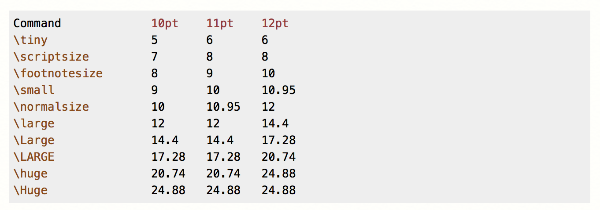

# Unsolved Problems

## Using text styles (such as textsc) in Typora and Pandoc

### MathJax's solution

Works in Typora, works in same block, but doesn't work in pandoc) [<https://github.com/mathjax/MathJax/issues/1940#issue-301367142>]

  ```latex
  \def\textsc#1{\dosc#1\csod}
  \def\dosc#1#2\csod{\text{#1}\small\style{text-transform: uppercase}{\text{#2}}}
  ```

### [Abnerlee's solution](https://github.com/typora/typora-issues/issues/1269)

Works in pandoc conversion, doesn't work

  ```latex
  \def\sc#1{\dosc#1\csod}
  \def\dosc#1#2\csod{{\rm #1{\small #2}}}
  ```

## Coloring text in LaTeX

See discussion at [pandoc-discuss](https://groups.google.com/forum/?utm_medium=email&utm_source=footer#!msg/pandoc-discuss/m5zNI4h9xoo/w1xjWLCqCAAJ) and [pandoc-latex-color issue](https://github.com/chdemko/pandoc-latex-color/issues/1). This I have an idea of how to fix, but author of `pandoc-latex-color` wasn't helpful. But I do have a [half-done fork](https://github.com/gandalfsaxe/pandoc-latex-color) that I could try to finish at some point.

# General LaTeX Guides

* Really good slideshow, intro to LaTeX and good tips: <https://figshare.com/articles/Modern_LaTeX_Usage/763250>
  [[PDF link](assets/modernLaTeX.pdf)]
* An essential guide to LATEX 2ε usage - Obsolete commands and packages: <http://mirrors.dotsrc.org/ctan/info/l2tabu/english/l2tabuen.pdf>
* Everything on Sharelatex: <https://www.sharelatex.com/learn>
* LaTeX nano companion: <https://msu.edu/~amunn/latex/nano-companion.pdf> (beginner's guide, goes through `geometry`, `fancyhdr`, `titlesec`, `enumitem`, `parskip`, `setspace`, `booktabs`)

# File Extension Meanings

Source: <http://hopf.math.purdue.edu/doc/html/suffixes.html>

The following is a list of most of the common file extensions used for UNIX (La)TeX files and what they mean. They are in the order in which you are likely to come across them rather than alphabetic order.

* `.tex` ... denotes a *source* file for any *flavour* of *TeX*

* `.cls` ... denotes a *LaTeX 2e* **class** file

* `.clo` ... denotes a *LaTeX 2e* **class option** file

  usually **option**s associated with a **class** are defined in a `.cls` file, but occasionally they are defined in separate `.clo` files

* `.sty` ... denotes a *LaTeX* (or *AmS-TeX*) **package**/**style** file

  *LaTeX 2.09* made no distinction between **class**es and **package**s ... all such files were *style* files - hence the suffix. *LaTeX 2e* has retained the suffix for what it now terms as **package**s

* `.log` ... denotes a *log* file for any *flavour* of *TeX*

* `.aux` ... denotes an *aux*iliary file.

  generated by running `latex` (or `etex`) on a *source* file. It typically contains information `latex` needs on a second pass to construct `\ref`s and `\cite`s and information that `bibtex` needs to construct a `.bbl` file. See [*BibTeX*](http://hopf.math.purdue.edu/doc/html/texhelp/Bibtex.html). Also [Auxiliary Files](https://www.dickimaw-books.com/latex/novices/html/auxiliary.html).

* `.toc` ... denotes an *table of contents* file

  generated by `latex` when the source file contains the line`\tableofcontents`

* `.lot` ... denotes an *list of tables* file

  generated by `latex` when the source file contains the line`\listoftables`(Similar to a `.toc` file.)

* `.lof` ... denotes an *list of figures* file

  generated by `latex` when the source file contains the line`\listoffigures`(Similar to a `.toc` file.)

* `.bib` ... denotes a *BibTeX* source file

  such files contain the database from which the `.bbl` bibliography file is generated. See [*BibTeX*](http://hopf.math.purdue.edu/doc/html/texhelp/Bibtex.html).

* `.bst` ... denotes a *BibTeX* *style* file

  the style in which [`bibtex`](http://hopf.math.purdue.edu/doc/html/texhelp/Bibtex.html) presents the `.bbl` bibliography file.

* `.bbl` ... denotes a *(La)TeX* bibliography file

  usually generated by [`bibtex`](http://hopf.math.purdue.edu/doc/html/texhelp/Bibtex.html).

* `.blg` ... denotes a *BibTeX* log file.

* `.idx` ... denotes a *MakeIndex* **index** source file

  contains `\indexentry` commands generated by a first pass of a *TeX* source file through a flavour of *TeX*. See [*MakeIndex*](http://hopf.math.purdue.edu/doc/html/texhelp/Makeindex.html).

* `.ist` ... denotes a *MakeIndex* *style* file

  needed only when the default manner in which [`makeindex`](http://hopf.math.purdue.edu/doc/html/texhelp/Makeindex.html) processes an `.idx` file needs to be over-ridden, e.g. when `makeindex` is used for generating a `.gls` glossary file.

* `.ind` ... denotes a *(La)TeX* **index** file

  usually generated by [`makeindex`](http://hopf.math.purdue.edu/doc/html/texhelp/Makeindex.html).

* `.ilg` ... denotes a *MakeIndex* log file.

* `.glo` ... denotes a *MakeIndex* **glossary** source file

  contains `\glossaryentry` commands generated by a first pass of a *TeX* source file through a flavour of *TeX*. See [*MakeIndex*](http://hopf.math.purdue.edu/doc/html/texhelp/Makeindex.html).

* `.gls` ... denotes a *TeX* **glossary** file

  usually generated by [`makeindex`](http://hopf.math.purdue.edu/doc/html/texhelp/Makeindex.html), which needs an appropriate `.ist` file to over-ride the *MakeIndex* defaults that produce indexes.

* `.glg` ... denotes a *MakeIndex* **glossary** log file.

* `.dtx` ... denotes a file containing *(La)TeX* **package**(s)/**class**(es) together with its documentation

  Running *(La)TeX* on the file usually generates the `.dvi` documentation. An accompanying `.ins` file calls `docstrip.tex` to strip the *(La)TeX* **package**(s)/**class**(es) from the `.dtx` file and sometimes also a `.drv` file.

* `.ins` ... denotes a *(La)TeX* install file

  Running *(La)TeX* on the file strips **package** or **class** files from accompanying `.dtx` files(s).

* `.drv` ... denotes a *(La)TeX* *driver* file

  Sometimes stripped from a `.dtx` file by running *(La)TeX* on an `.ins` file. Running *(La)TeX* on the `.drv` file generates the `.dvi` documentation.

# Beyond LaTeX

Personal opinion: Use `LaTeX2e` and wait for `LaTeX3` (could take ages though), unless good reason for `XeLaTeX` or `LuaTeX`.

**Good reasons to use XeLaTeX or LuaTeX:**

* Want to use Unicode in source code for any reason, e.g. for different a alphabet such as Arabic
* Want to use different fonts, especially OpenType fonts.

**Reasons not to use XeLaTeX or LuaTeX:**

1. Both seems to have has less developed microtypography than `LaTeX`.
2. Both are less supported by journals, conferences etc.

## Tips for XeLaTeX**

* Use `fontspec` as an interface for font settings.
* Use `polyglossia` as replacement for babel.

# References

[^9essential]: http://archive.is/m2nLL
[^algorithm]: <https://tex.stackexchange.com/questions/229355/algorithm-algorithmic-algorithmicx-algorithm2e-algpseudocode-confused>
[^babel-SO]: <https://tex.stackexchange.com/questions/27740/whats-the-benefit-of-loading-babel-when-writing-in-english>
[^babel]: <https://www1.essex.ac.uk/linguistics/external/clmt/latex4ling/babel/>
[^fontenc2]: <https://tex.stackexchange.com/questions/664/why-should-i-use-usepackaget1fontenc>
[^fontenc]: <https://tex.stackexchange.com/a/44697/39354>
[^geometry]: <https://www.sharelatex.com/learn/Page_size_and_margins>
[^input-include]: <https://tex.stackexchange.com/a/32058/39354>
[^microtype2]: <https://tex.stackexchange.com/a/586/39354>
[^modular]: <https://en.wikibooks.org/wiki/LaTeX/Modular_Documents>
[^subfigs-table]: <https://tex.stackexchange.com/a/330562/39354>
[^subfiles]: http://mirrors.dotsrc.org/ctan/macros/latex/contrib/subfiles/subfiles.pdf
[^xfrac]: <https://tex.stackexchange.com/a/202327/39354>
[^microtype]: http://www.khirevich.com/latex/microtype/
[^allowlitunits]: <https://tex.stackexchange.com/a/8229/39354>
[^csl-vs-biblatex]: <https://tex.stackexchange.com/questions/434946/citation-style-language-vs-biblatex-vs-possibly-other-citing-systems>
[^bib-visual]: <https://tex.stackexchange.com/a/299286/39354>
[^bib-factual]: <https://tex.stackexchange.com/a/25702/39354>
[^csl-in-latex]: <https://tex.stackexchange.com/questions/69267/citation-style-language-csl>
[^natbib-biblatex]: <https://tex.stackexchange.com/a/5105/39354>
[^natbib-documentation]: http://mirrors.dotsrc.org/ctan/macros/latex/contrib/natbib/natbib.pdf
[^sharelatex-biblatex]: <https://www.sharelatex.com/learn/Bibliography_management_in_LaTeX>
[^sharelatex-natbib]: <https://www.sharelatex.com/learn/Bibliography_management_with_natbib>
[^pandoc-citations]: <https://pandoc.org/MANUAL.html#citations>
[^avoid-eqnarray]: http://www.tug.org/pracjourn/2006-4/madsen/madsen.pdf
[^equation-vs-align]: <https://tex.stackexchange.com/questions/321/align-vs-equation>
[^math-space]: <https://www.sharelatex.com/learn/Spacing_in_math_mode>
[^amssymb-symbols]: http://milde.users.sourceforge.net/LUCR/Math/mathpackages/amssymb-symbols.pdf
[^ams-display]: <https://tex.stackexchange.com/a/69854/39354>
[^tex-$$]: <https://tex.stackexchange.com/questions/503/why-is-preferable-to>
[^number-equations]: <https://math.stackexchange.com/a/2362216/236053>
[^mermain]: http://www.geo.umass.edu/faculty/wclement/Writing/equations.pdf
[^hwang]: http://www.ams.org/notices/199508/hwang.pdf
[^align*-vs-aligned]: <https://tex.stackexchange.com/questions/95402/what-is-the-difference-between-aligned-in-displayed-mode-and-starred-align>
[^equation-vs-align2]: <https://latex.org/forum/viewtopic.php?t=8693>
[^sharelatex-amsmath]: <https://www.sharelatex.com/learn/Aligning_equations_with_amsmath>
[^env-difference]: <https://tex.stackexchange.com/questions/239252/what-is-the-difference-between-split-multline-align-breqn-for-breakin>
[^inline-math]: <https://tex.stackexchange.com/questions/510/are-and-preferable-to-dollar-signs-for-math-mode>
[^display-math]: <https://tex.stackexchange.com/questions/503/why-is-preferable-to>
[^math-notation]: <https://tex.stackexchange.com/questions/40492/what-are-the-differences-between-align-equation-and-displaymath>
[^ams-dependencies]: <https://tex.stackexchange.com/questions/32100/what-does-each-ams-package-do>
[^fontenc2]: <https://tex.stackexchange.com/questions/664/why-should-i-use-usepackaget1fontenc>
[^geometry-manual]: http://mirrors.dotsrc.org/ctan/macros/latex/contrib/geometry/geometry.pdf
[^color-vs-xcolor]: <https://tex.stackexchange.com/q/89763/39354>
[^colorful-equations]: http://adereth.github.io/blog/2013/11/29/colorful-equations/
[^overleaf-listings-theme]: <https://www.overleaf.com/latex/examples/syntax-highlighting-in-latex-with-the-listings-package/jxnppmxxvsvk>
[^sharelatex-listings-theme]: <https://www.sharelatex.com/learn/Code_listing#Code_styles_and_colours>
[^parskip]: <https://tex.stackexchange.com/a/40432>
[^mathjax-colors]: <https://github.com/mathjax/MathJax/issues/2013>
[^csquotes]: https://tex.stackexchange.com/questions/229638/package-biblatex-warning-babel-polyglossia-detected-but-csquotes-missing
[^csquotes2]: https://tex.stackexchange.com/questions/39285/whats-the-advantage-of-using-csquotes-over-using-an-editors-auto-replacement-f
[^csquotes-doc]: https://mirror.hmc.edu/ctan/macros/latex/contrib/csquotes/csquotes.pdf